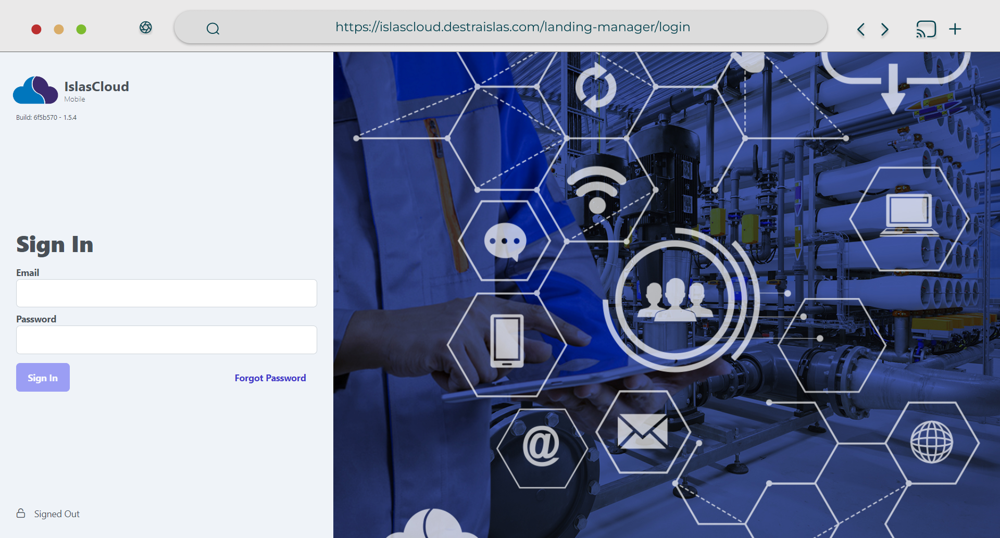
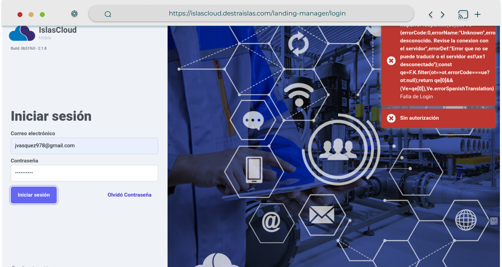
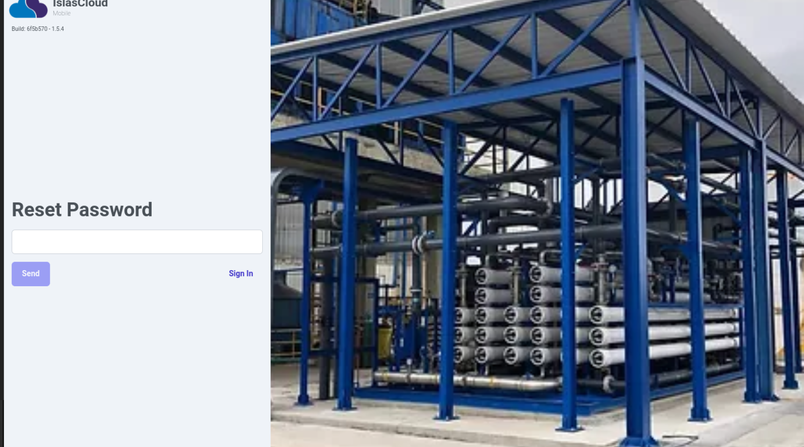
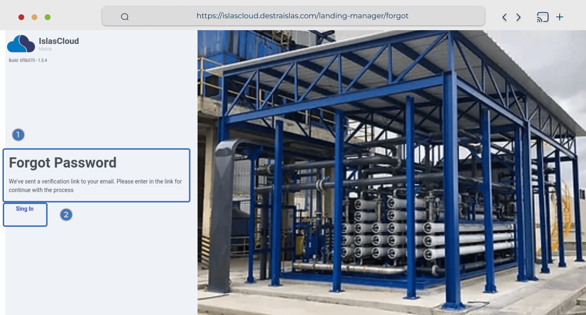
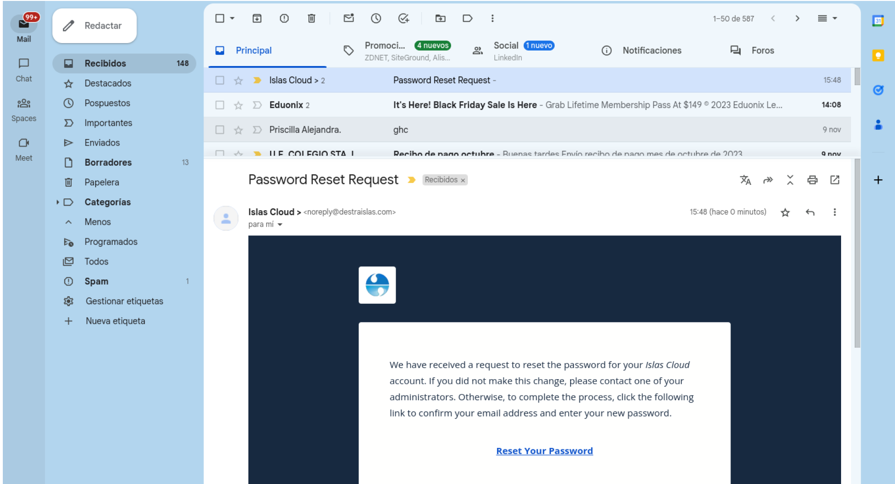
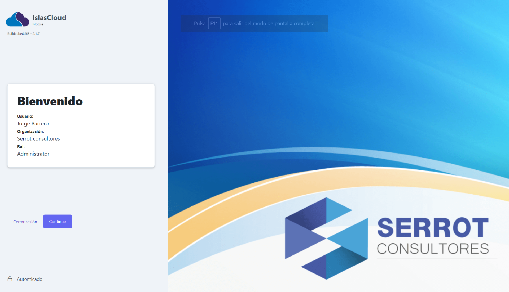

import Highlight from '@site/src/components/Highlight/Highlight';
import mediumZoom from 'medium-zoom';
import { FaHouse } from "react-icons/fa6";

# Login ✨

<Highlight color="#999999">Módulo de Login</Highlight>

{/* Info */}
 

## Inicio de Sesión del Sistema IslasCloud Mobile

> Esta sección explica las funcionalidades que se pueden realizar en el sistema de inicio de sesión de la aplicación IslasCloud Mobile.

## Ingreso a IslasCloud

> Para ingresar a IslasCloud se requiere un **`usuario y contraseña`**.

> El usuario es el **`correo electrónico`** registrado en el sistema.

> La **`contraseña`** es la que definió el administrador de la aplicación durante el registro del usuario.

## Pasos para ingresar

> Para ingresar al sistema se procede a ejecutar en un explorador de internet **(safari, opera, chrome,firefox, etc.)** y en el campo  la URL **`(Uniform Resource Locator)`** del navegador, ingresa la siguiente dirección web: [https://islascloud.destraislas.com/landing-manager/login](https://islascloud.destraislas.com/landing-manager/login).

> En la página de inicio de sesión, navega hacia el campo email e ingresa el **correo electrónico**, continuas con el campo **contraseña** e Ingresa tu contraseña.
Haz clic en el botón Iniciar Sesión para ingresar al sistema.
Si los datos son correctos accederás al sistema.

---

## Elementos de la interfaz

> 1. URL
> 2. Logotipo
> 3. Campos de email, password, boton de **Sign In**, y **Forgot. Password**
>4. Etiqueta Signed Out.
>5. Imagen de fondo. 

:::note Nota

En la imagen se resaltan los elementos visuales de la interfaz de usuario para ingresar al sistema en la vista **`Login`**.

:::

---

## Validación de Credenciales de Autenticación

> Al momento de ingresar los datos de la credenciales de autenticación al **`Sistema`**, si  son incorrectos el sistema arroja un mensje de **error** como el que se muestra en la imagen.

:::danger ERROR

Los datos ingresados son incorrectos.

:::

> Si olvidaste tu contraseña puedes recuperarla haciendo clic en **`¿Olvidó su contraseña?`** en la página de inicio de sesión.

> Se enviará un correo electrónico con las instrucciones para reestablecer la contraseña.

---
## Olvido su contrseña

> Este modulo ayuda al usuario a recuperar su contraseña realizando el procedimiento de reseteo de la clave anterior.

:::tip 

El procedimiento para recuperar la contraseña en caso de olvido, se da click, en el vinculo **`¿Olvidó su contraseña?`**, que redireccionaa a la ruta **[https://islascloud.destraislas.com/landing-manager/forgot](https://islascloud.destraislas.com/landing-manager/forgot)**. donde muestra el  formulario de recuperación, con el campo de correo electrónico, el usuario debe ingresar su correo electrónico y dar clic al botón enviar. esta accion lleva al la siguiente ruta **[https://islascloud.destraislas.com/landing-manager/success](https://islascloud.destraislas.com/landing-manager/success)**, que muestra la siguiente interfaz.

:::
---

## Verificación correctos

:::info[Mensaje de Verificación] 
**`Le hemos enviado un enlace de verificación a su correo electrónico. Por favor ingresa al link para continuar con el proceso`**, el usuario tien que verificar su correo electrónico para validar el enlace de recuperación de la contraseña.
:::

---
## Revisión de correo eléctronico 

> Al usuario el sistema enviará un mensaje con un enlace de recuperación de la clave.

:::tip Mensaje de Recuperación
Cuando le llega el correo de recuperación de contraseña, **debe ingresar al link que se encuentra en el correo, para continuar con el proceso de recuperación de la contraseña**. **`El enlace tiene duración de 24hrs para resetear el password`**, al momento de dar click al link, se le redirigira a la siguiente interfaz ver imagen siguiente, donde muestra el formulario de recuperación de la contraseña.
:::

---
## Recuperación de la contraseña

:::note[Reset Password] 
Este formulario **ayudara al usuario a resetear la contraseña para recuperar su clave y pueda ingresar al sistema nuevamente**. al momento de dar clic al boton enviar redirecciona a interfaz del login para que inicie la sesión de autenticación al sistema.
:::

---

## Ingreso al sistema
> Al momento en que el usaurio, se autentica  e ingresa al sistema, se muestra la siguiente información de bienvenida, como se aprecia en la imagen acontinuación se puede observar que hay un componente card con **`la información detalla del usuario, que describe el nombre, organización y su rol.`** cuando el usuario da click al boton de ingresar lo redireccionaa al **dashboar principal completando su autenticación e ingreso al sistema**.

---

## Dashboard Principal del sistema

> Vista del Dasboard Principal, cuando el usuario ingresa correctamente al Sistema.