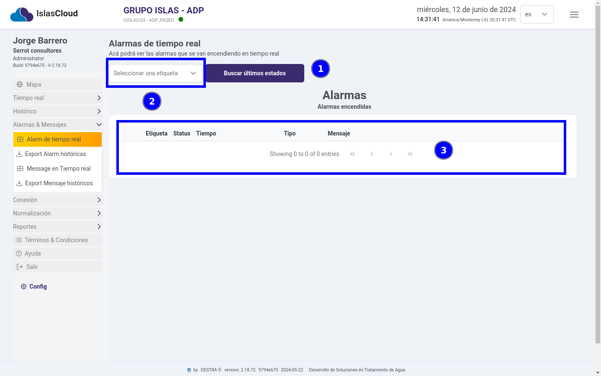
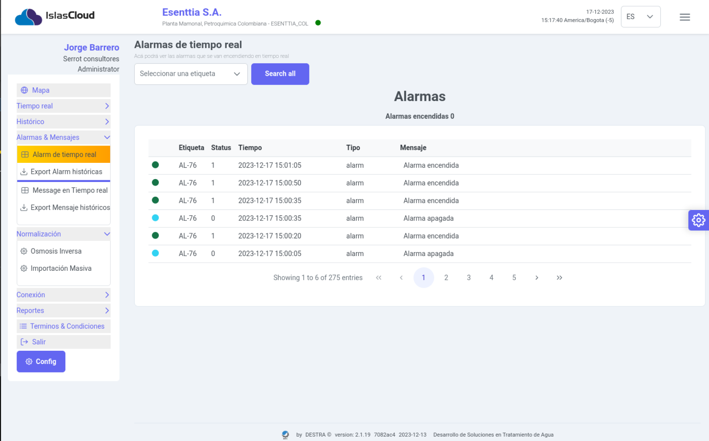
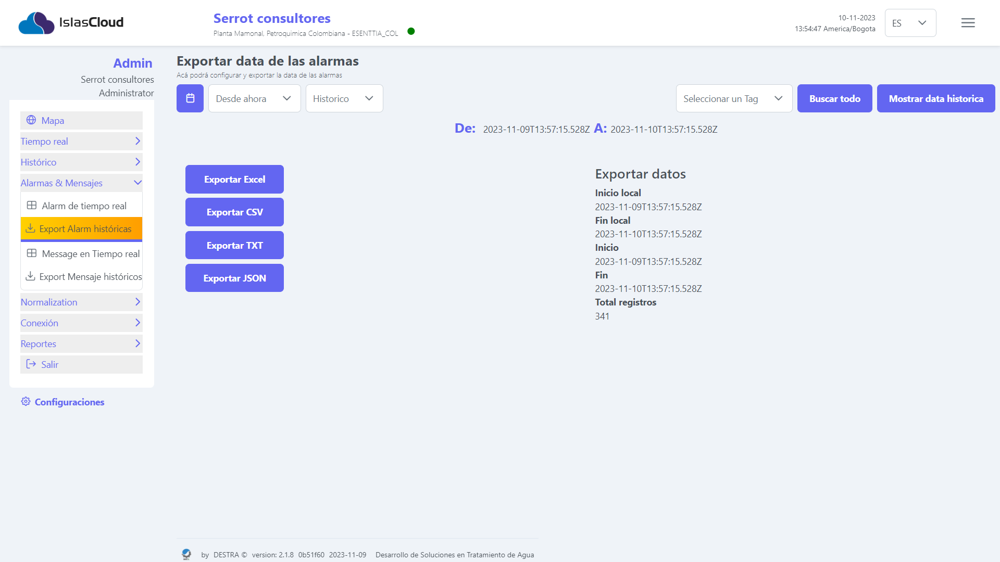
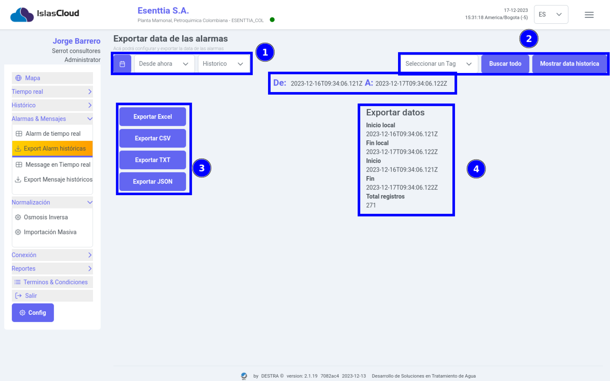
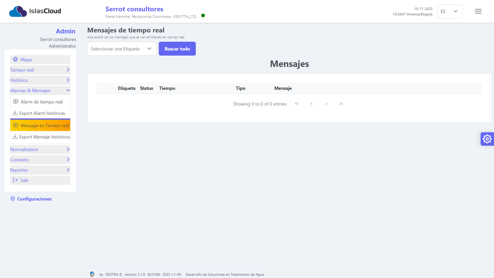
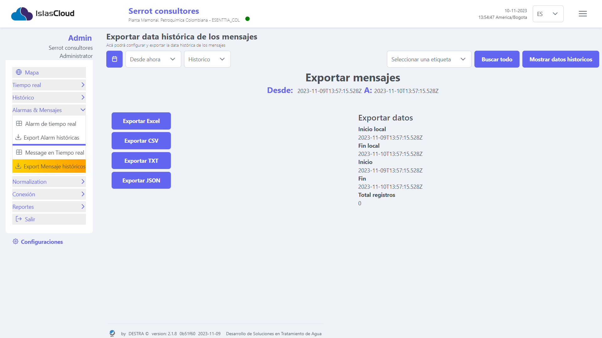
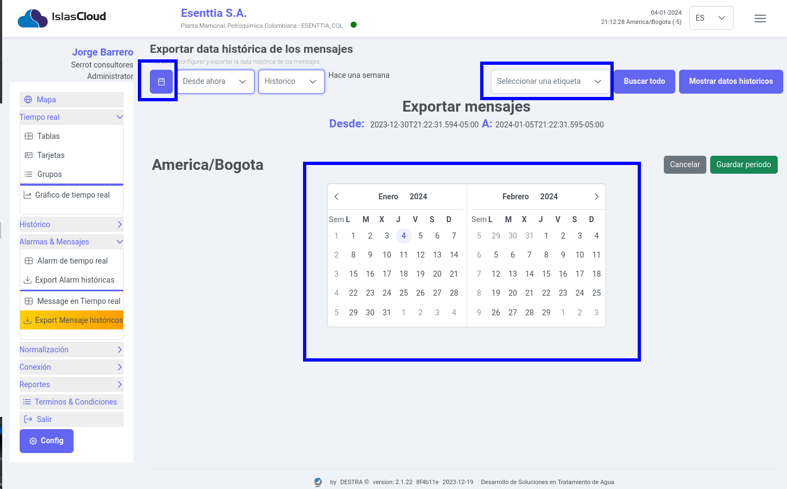
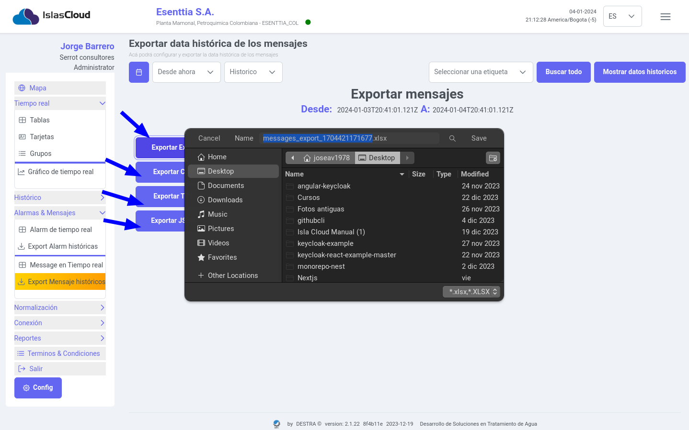

import Highlight from '@site/src/components/Highlight/Highlight';
import 'primeicons/primeicons.css';
import Tabs from '@theme/Tabs';
import { FcMenu } from "react-icons/fc";

import TabItem from '@theme/TabItem';

# Alarmas & Mensajes

<Highlight color="#666">Alarmas & Mensajes</Highlight>

## Módulo Alarmas & Mensajes

### Alarmas tiempo real
> El módulo de **Alarmas**  tiene como función principal la visualización en tiempo real de las alarmas provenientes de diversos sensores, llevando un registro histórico de las mismas.

> **Esa tabla permitiría tener un registro histórico de todas las alarmas ocurridas, conocer cuáles están aún activas y tener la información necesaria para que un operador pueda evaluar y atender la situación que la provocó.**

---

:::note Nota

>La información Cada alarma queda almacenada en una tabla con los siguientes campos:

- Etiqueta **Nombre del sensor**
- Estatus **(activa/inactiva)**
- Tiempo **Fecha y hora cuando se activó la alarma**
- Tipo **Identificador del tipo de alarma**
- Mensaje **Descripción textual de la alarma**

:::

---

### Exportar Alarmas

> El módulo de exportar alarmas  tiene como función principal de configurar y exportar la data de las alarmas.

> Interfaz del módulo de exportar alrmas
---

> Elementos principales del módulo exportar data de las alarmas.

:::info[]
1. Botón de selección de **fecha**, lista desplegable **desde ahora, Histórico**.
2. Lista desplegable **Seleccionar un tag**, y botones **Buscar todo, mostrar data histórica**.
3. Botones **Exportar Excel**,**Exportar CSV**,**Exportar TXT**,**Exportar JSON**
4. **Descripción de exportar datos**

:::
----

### Mensajes tiempo real

> El módulo de **Mensajes**  tiene como función principal la visualización en tiempo real de los mensajes provenientes de los sensores, llevando un registro histórico de las mismas.

:::note Nota

>La información Cada alarma queda almacenada en una tabla con los siguientes campos:

- Etiqueta **Nombre del sensor**
- Estatus **(activa/inactiva)**
- Tiempo **Fecha y hora cuando se activó la alarma**
- Tipo **Identificador del tipo de alarma**
- Mensaje **Descripción textual de la alarma**

:::

---

> Elementos principales del módulo exportar data de las alarmas.

---

> Elementos principales del módulo exportar data de las alarmas.

---

> Elementos principales del módulo exportar data de las alarmas.al seleccionar algunos de los botones para realizar la exportación del archivo del reporte historico de las alarma muestra el siguiente cuadro de dialogo para guardar la información en el equipo.

:::info[Acciones exportar]
1. Botón de selección de **fecha**, lista desplegable **desde ahora, Histórico**.
2. Lista desplegable **Seleccionar un tag**, y botones **Buscar todo, mostrar data histórica**.
3. Botones **Exportar Excel**,**Exportar CSV**,**Exportar TXT**,**Exportar JSON**
4. **Descripción de exportar datos**

:::

