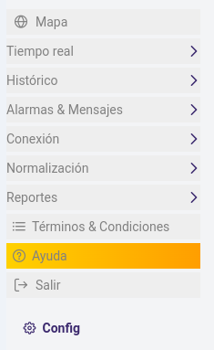
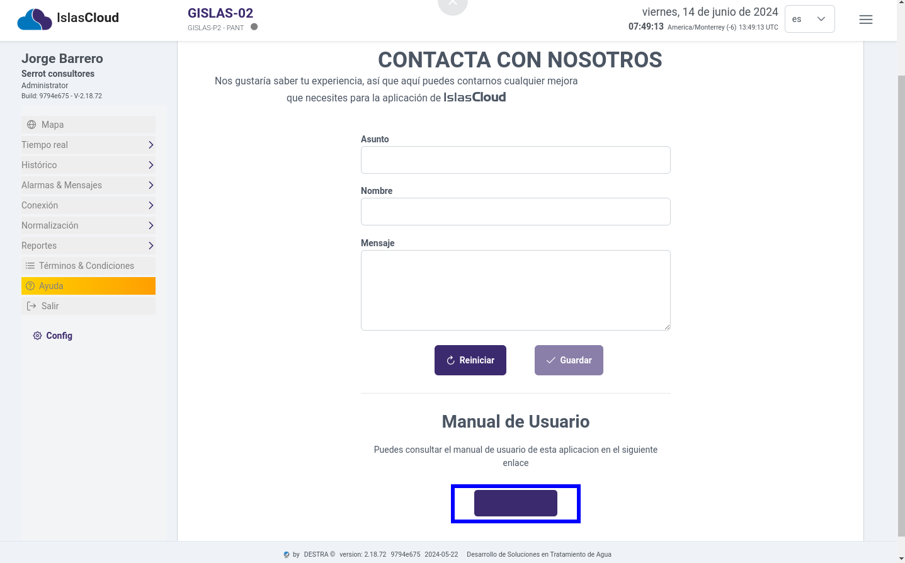

import Highlight from '@site/src/components/Highlight/Highlight';
import 'primeicons/primeicons.css';
import Tabs from '@theme/Tabs';
import { FcMenu } from "react-icons/fc";

import TabItem from '@theme/TabItem';

# Ayuda

<Highlight color="#666">Ayuda</Highlight>

## Módulo Ayuda

> Menu de navegacion para la ayuda

:::info
Módulo de ayuda al usuario del sistema, este módulo contiene un formulario con la función de enviar un correo al administrador del sistema sobre los mensajes que  envían a los usuarios.
::: 

### Formulario 

> Formulario de contacto con el administrador y enlace para el manual de ayuda

---