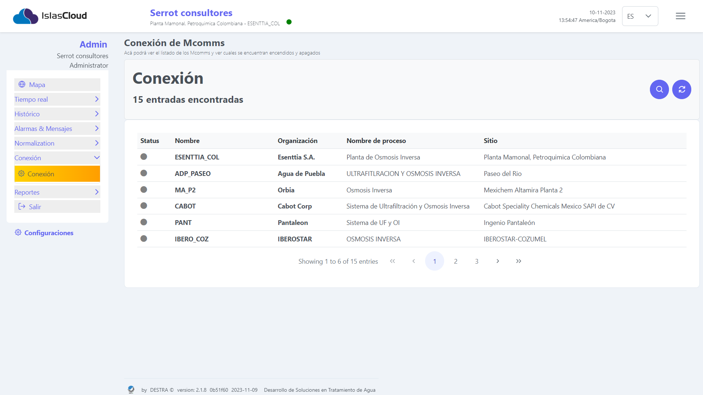
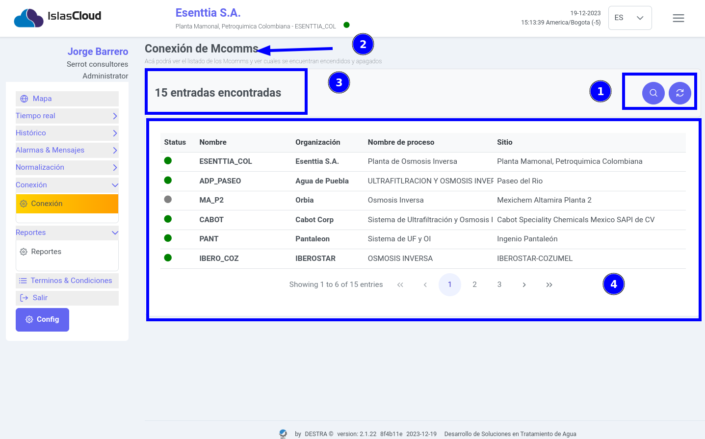
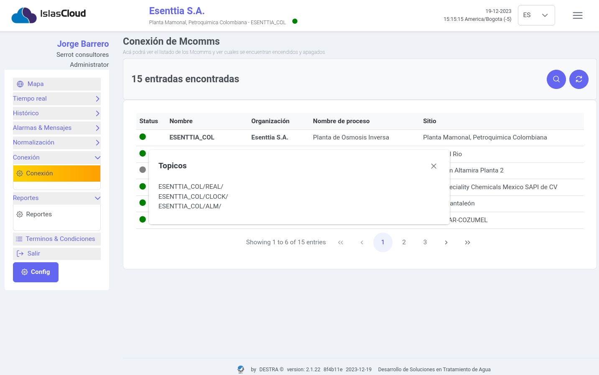
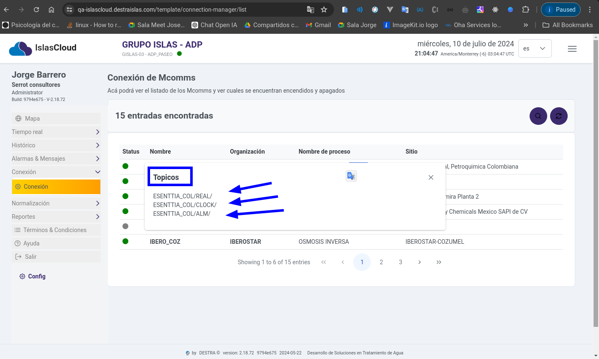

import Highlight from '@site/src/components/Highlight/Highlight';
import 'primeicons/primeicons.css';
import Tabs from '@theme/Tabs';
import { FcMenu } from "react-icons/fc";

import TabItem from '@theme/TabItem';

# Conexión

<Highlight color="#666">Conexión</Highlight>

## Módulo Conexion

> Módulo de la conexión de los **sensores Mcomm**

> Listado de los **Mcomms**, para ver cuáles  se encuentran encendidos y apagados.

---

### Elementos módulo de Conexión
> 

> En la imagen se puede observar los elementos principales del módulo de conexión, **1) Botón de busqueda (filtrar) y botón de actualizar**, **2) Nombre del Módulo**, **3)Cantidad de registros**, **4) tabla que contiene los siguientes campos: **Status: muestra si el sensor esta encendio o apagado**, Nombre: describe el nombre del sensor, Organización: Muestra el nombre de la organización, Nombre de proceso: describe el tipo de proceso, Sitio: dirección fisíca de la Organización** 

---
### Elementos de los tópicos
> 

> Al momento de dar click a un registro se muestra el siguiente mensaje que contiene los elementos de los tópicos.

