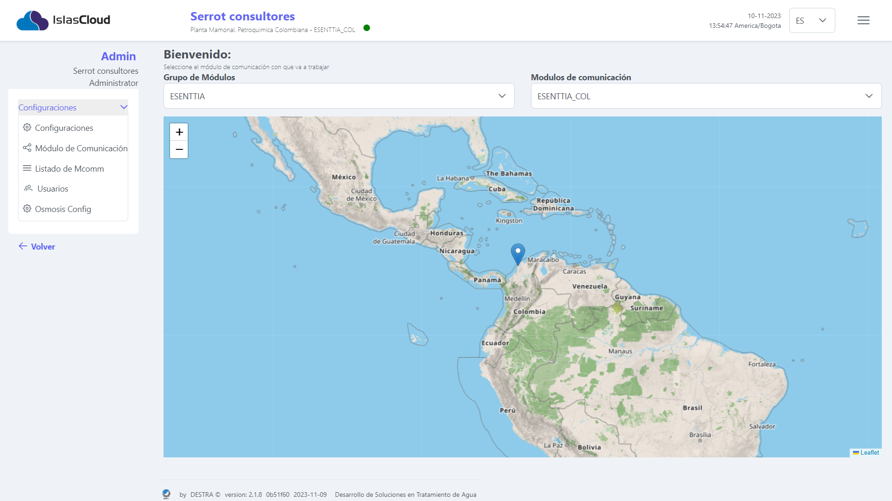
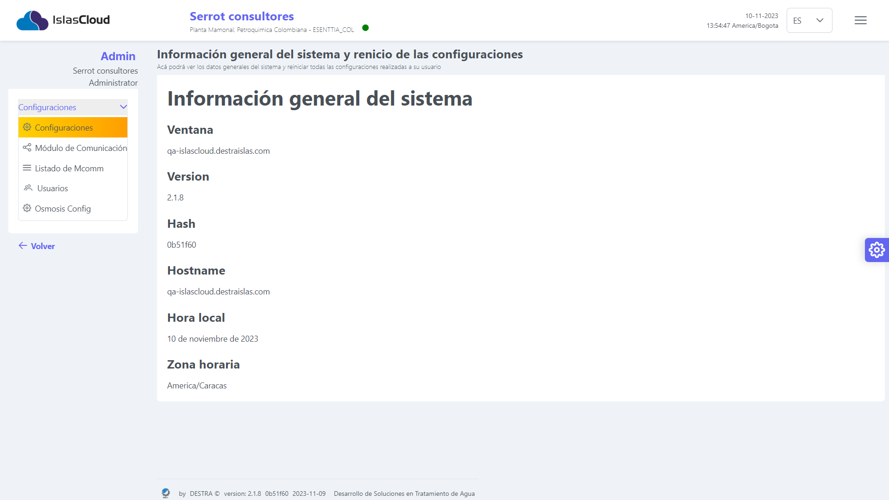
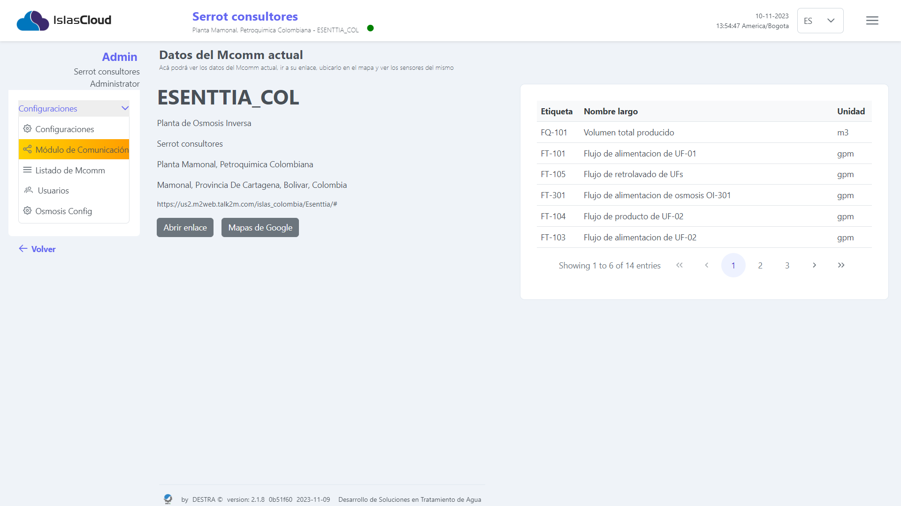
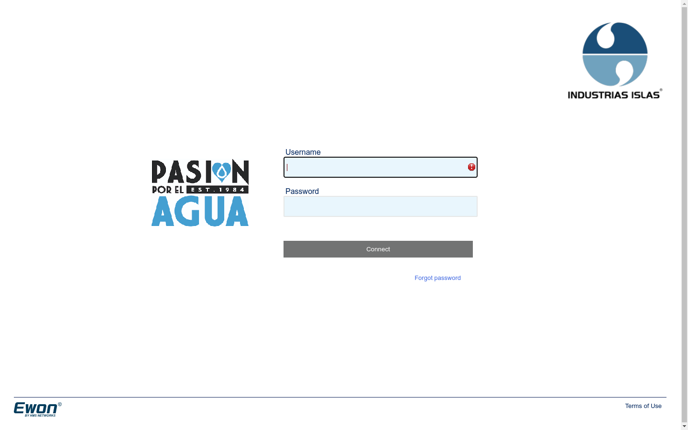
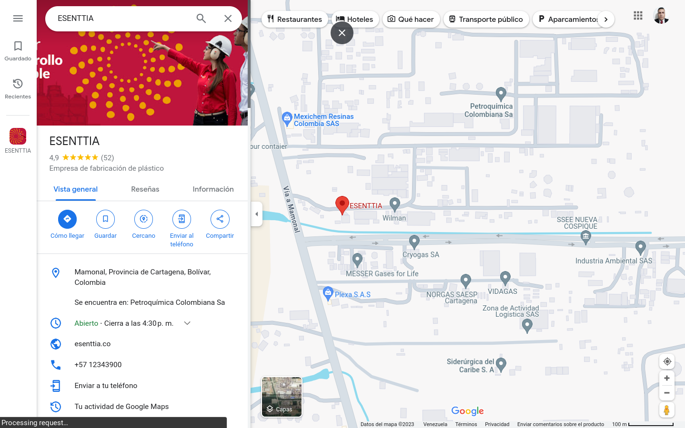
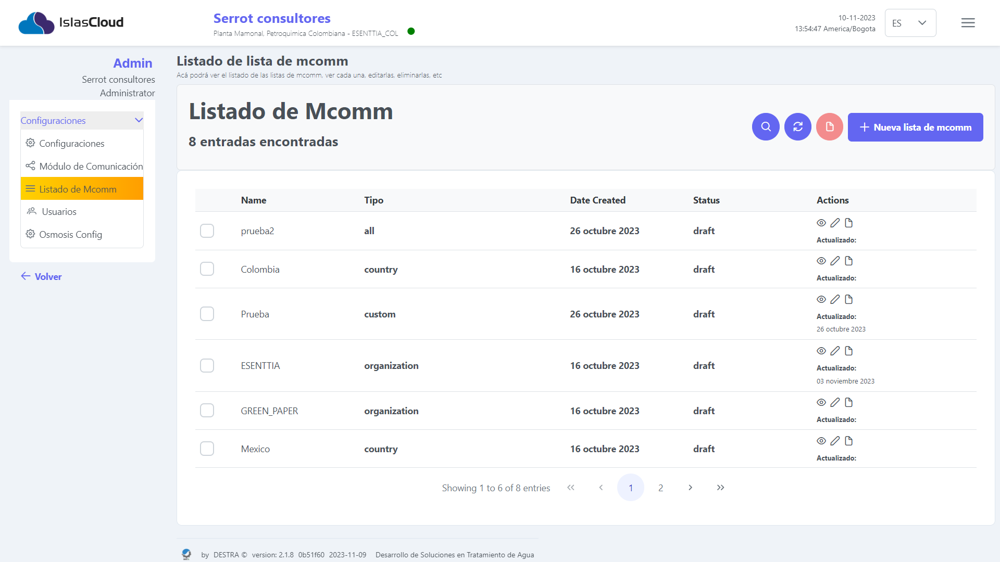
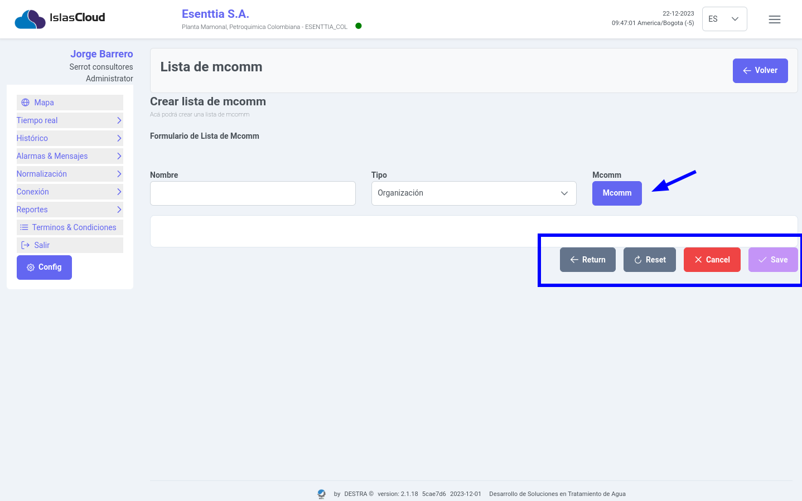
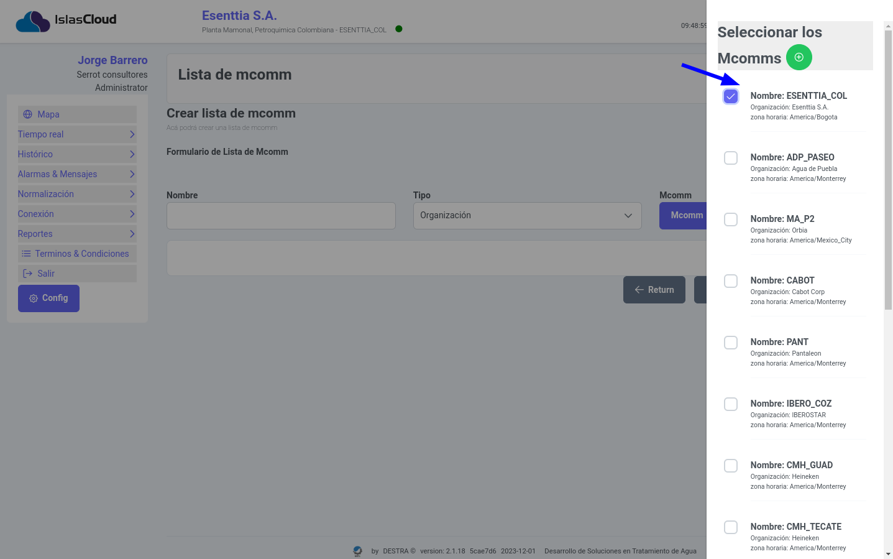
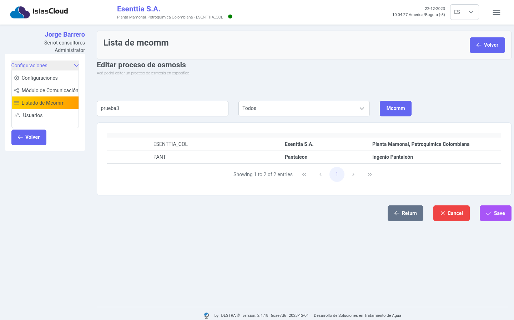

import Highlight from '@site/src/components/Highlight/Highlight';
import 'primeicons/primeicons.css';
import Tabs from '@theme/Tabs';
import { FcMenu } from "react-icons/fc";

import TabItem from '@theme/TabItem';

# Configuraciones

<Highlight color="#666">Configuraciones</Highlight>

## Módulo Configuraciones

 :::warning[INFO]
   
   Únicamente los usuarios con roles de Administrador (**Admin**) y Tecnología de la Información (**IT**) tienen privilegios de acceso a los módulos de **Configuración** y **Usuario**. Esta distinción se aplica exclusivamente en el contexto de la interfaz del usuario.
 :::
## Configuraciones 
> Para acceder a este módulo el **usuario debe seleccionar** con un clic el boton `config`, Este módulo muestra al usuario **las configuraciones del sistema como la información general, los datos del Mcomm actual y sus valores, los datos de la cuenta de usuario del sistema**.
---

### Módulo de Información General del Sistema 

> **Este módulo muestra al usuario la información general del sistema**
---

> `Información General del sistema`,  **Ventana, Versión, Hash, Hotname, hora local, Zona horaria.**
---

### Módulo de comunicación

> Este módulo muestra al usuario la información del sensor Mcomm, una representación de los datos en una tabla auxiliar, con información del nombre **Etiqueta o nombre corto**, **Nombre largo del sensor** y la **Unidad de medida.**
---

> `Interfaz gráfica del módulo de comunicación`, cuenta con los botones **Abrir enlace** y **Mapa de google**, el botón **Abrir enlace** abre una ventana con la información del sensor y el botón **Mapa de google** abre una ventana con la ubicación fisíca del mcomm.

---

### Enlace para ingresar al administrador del mcomm

>Para acceder al URL el usuario debe seleccianar con un clic el botón    [https://us2.m2web.talk2m.com/islas_colombia/Esenttia/#](https://us2.m2web.talk2m.com/islas_colombia/Esenttia/#), esta area solo ingresa el administrador del sistema.

---

### Ubicación fisíca de la planta en donde esta instalado el mcomm
> Para acceder al **URL** el usuario debe seleccianara con un clic el botón  ,  `despúes Atraves de la ubicagión GPS, se muestra el mapa con las coordenadas y ubicación fisíca de la planta donde se encuentra instalado el flexy mcomm`. **en este ejemplo de la imagen podemos ver la ubicación de la Planta Mamonal, Petroquimica Colombiana - ESENTTIA_CO, ubicada en el país de Colombia**.

----

---
## Módulo Listado Mcomm

### Listado de Mcomm
> Este módulo permite  al usuario gestionar el listado de los Mcomm, la información se muestra en la tabla que contiene la siguiente descripción **Name nombre del mcomm, tipo, fecha de creación, status, aciones**

---

### Crear Listado de Mcomm
> Este módulo permite  al usuario gestionar el listado de los Mcomm, la información se muestra en la tabla que contiene la siguiente descripción **Name nombre del mcomm, tipo, fecha de creación, status, aciones**

---

### Seleccionar Mcomm

> Este módulo permite  al usuario gestionar el listado de los Mcomm, la información se muestra en la tabla que contiene la siguiente descripción **Name nombre del mcomm, tipo, fecha de creación, status, aciones**

---
### Editar Listado de Mcomm 
> Este módulo permite  al usuario gestionar la edición  listado de los Mcomm.

