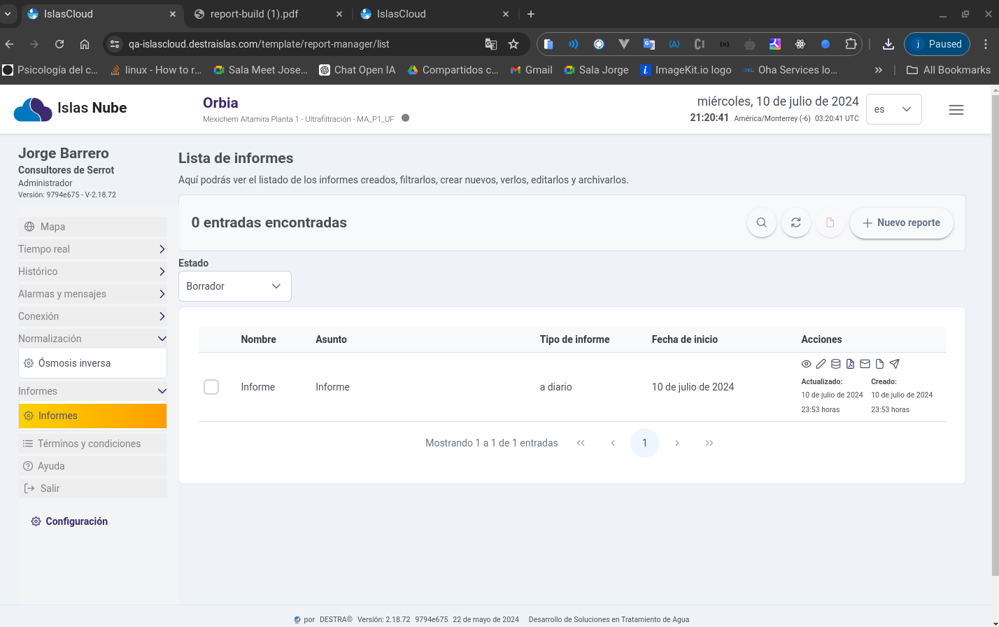
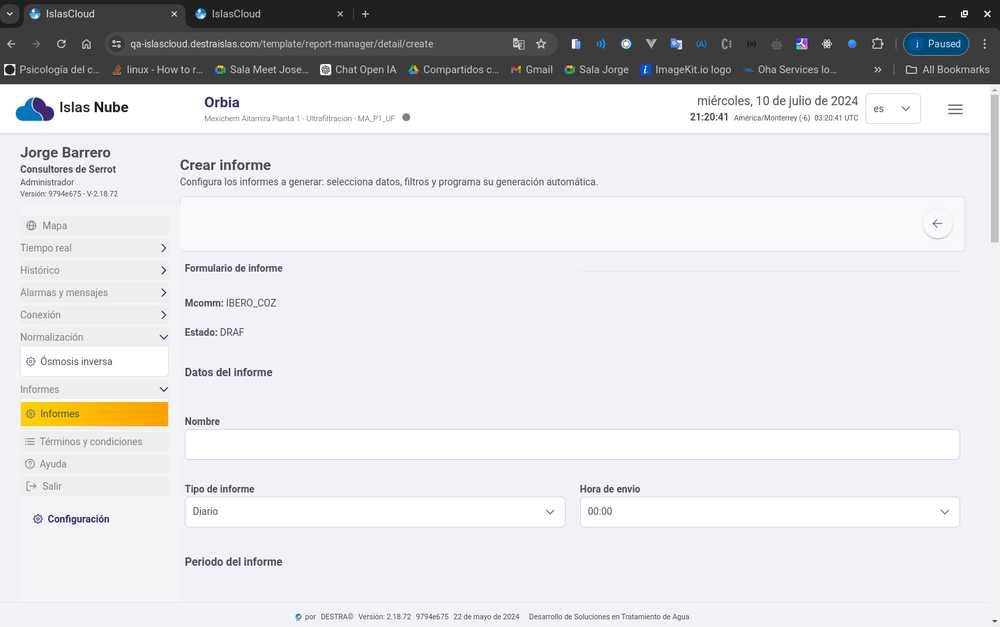
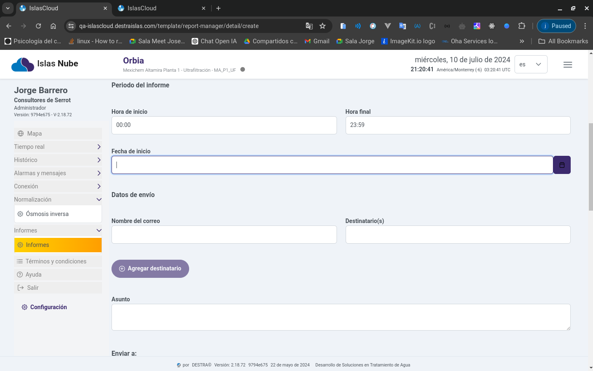
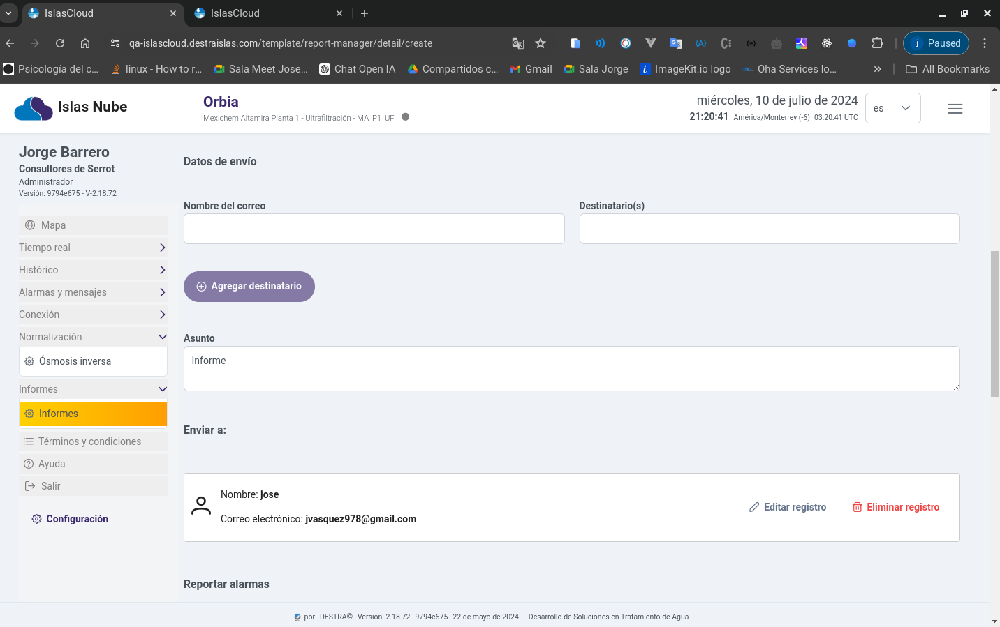
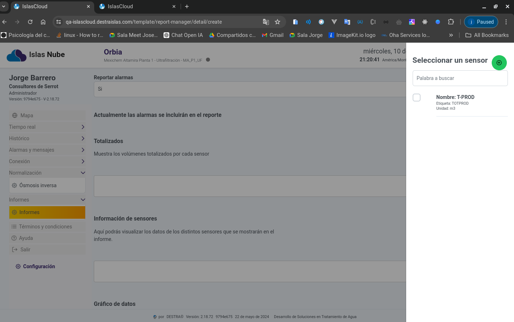
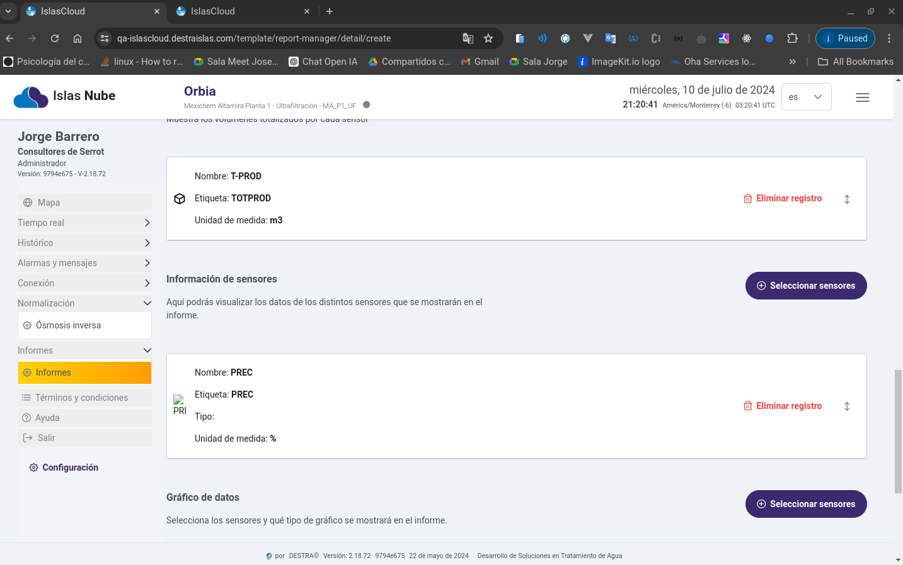
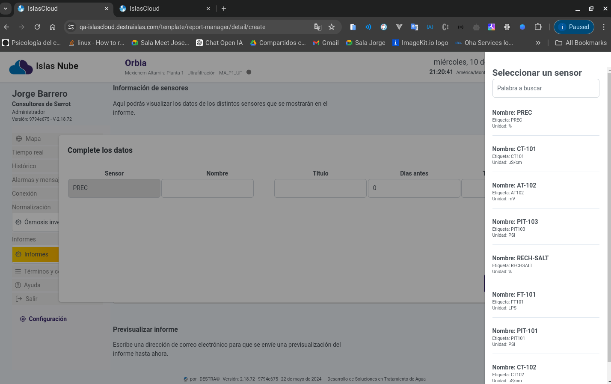
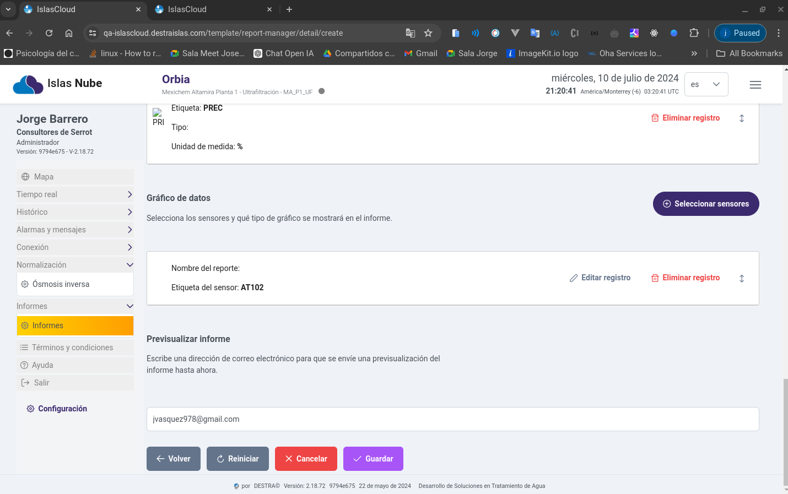
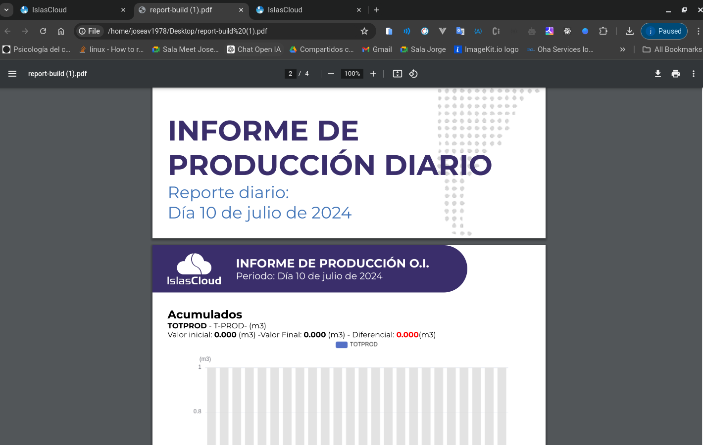

import Highlight from '@site/src/components/Highlight/Highlight';
import 'primeicons/primeicons.css';
import Tabs from '@theme/Tabs';
import { FcMenu } from "react-icons/fc";

import TabItem from '@theme/TabItem';

# Informe

<Highlight color="#666">Informe</Highlight>

# Módulo Informe

## Dasborad Informe

> Este módulo muestra la interfaz para realizar el informe de los procesos de ósmosis.

---