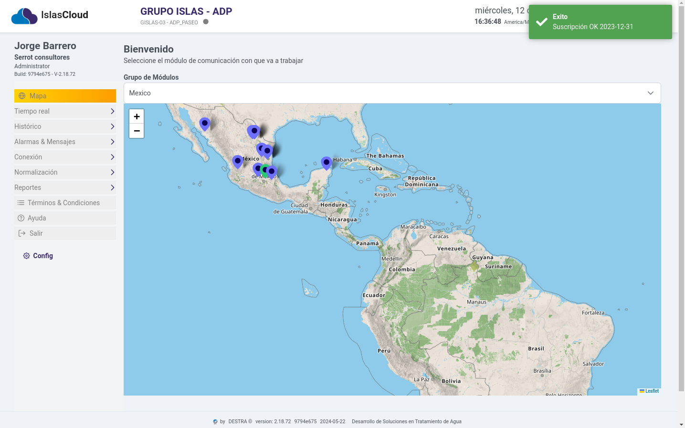
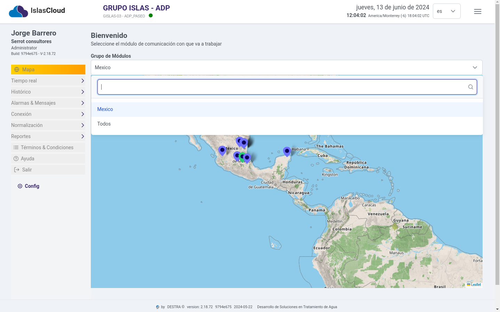
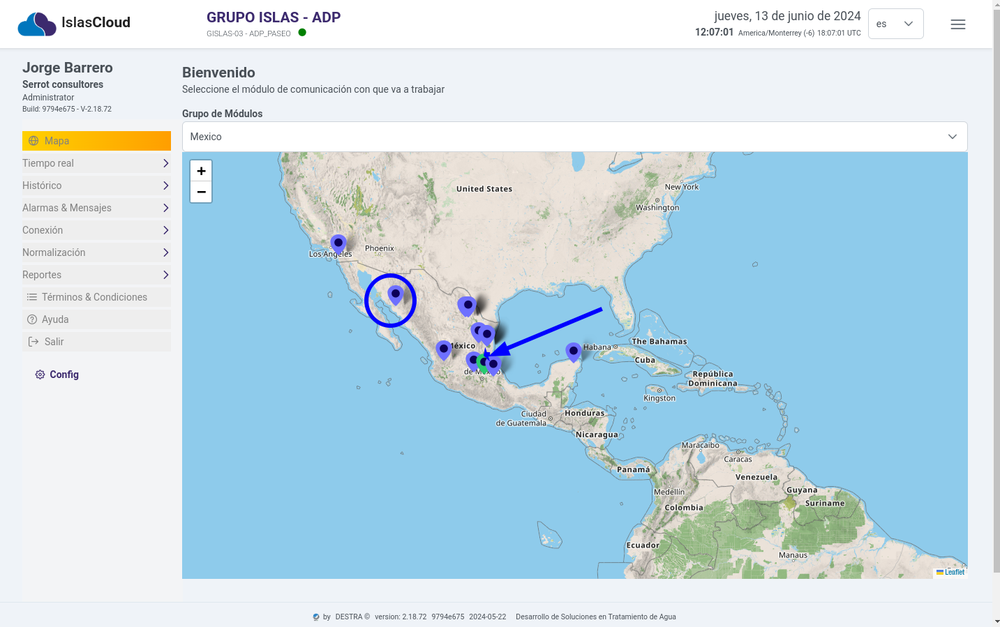
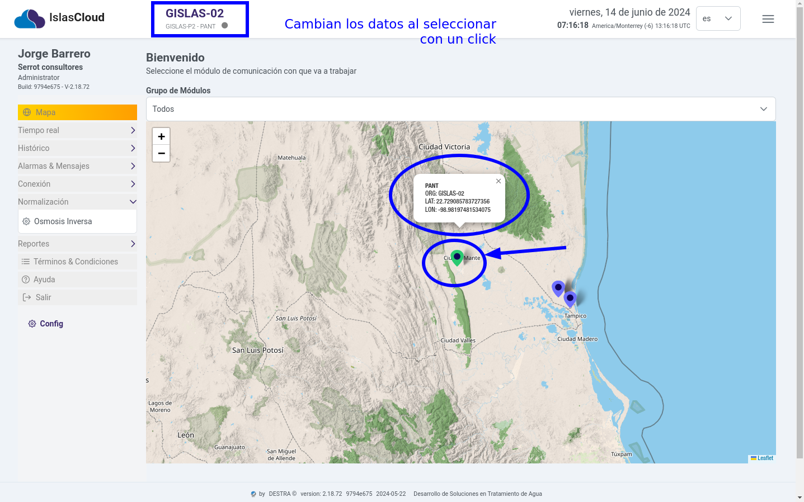

import Highlight from '@site/src/components/Highlight/Highlight';
import 'primeicons/primeicons.css';
import Tabs from '@theme/Tabs';
import { FcMenu } from "react-icons/fc";

import TabItem from '@theme/TabItem';

# Mapa Sensores 

<Highlight color="#666">Menú principal</Highlight>

## Bienvenidos al Sistema

### Dashboard Principal - Mapa 

> **Interfaz del Dasboard Principal**, esta compuesta con los siguientes elementos, menú de navegación hacia los diferentes módulos, dos listas desplegables, la primera **Grupos de módulos** que permite seleccionar el grupo de módulos de comunicaciones - **`Sensores`**.

---

### Grupo de Módulos

> Lista desplegable para seleccionar El **`grupo de módulos`**  

---

:::info
Al momento de seleccionar  con un clic el ícono de **gps**, redireccionaa a la vista **Tiempo Real Tablas**, interfaz que muestra  el listado de los sensores de manera detallada.
:::  

---

### Seleccionar una planta con un click

:::info
Al momento de seleccionar  con un clic el ícono de **gps**, se puede seleccionar o cambiar la planta el sistema arroja un mensajecon informacion del mcomm asociado y la ubicacion de la latitud y longitud.
:::  

---
### Cambio de idioma 

> Para cambiar el idioma del sistema, seleccione la lista desplegable (dropdown) de **idioma** y seleccione el idioma que desea utilizar.

:::info
Al momento de seleccionar  con un clic la lista desplegable se  cambia el idioma de la interfaz del sistema. **Solo se puede cambiar al idioma inglés o español**.
::: 

