import Highlight from '@site/src/components/Highlight/Highlight';
import 'primeicons/primeicons.css';
import Tabs from '@theme/Tabs';

import TabItem from '@theme/TabItem';

# Módulos

<Highlight color="#666">Usuarios del Sistema</Highlight>

## Módulo Reportes
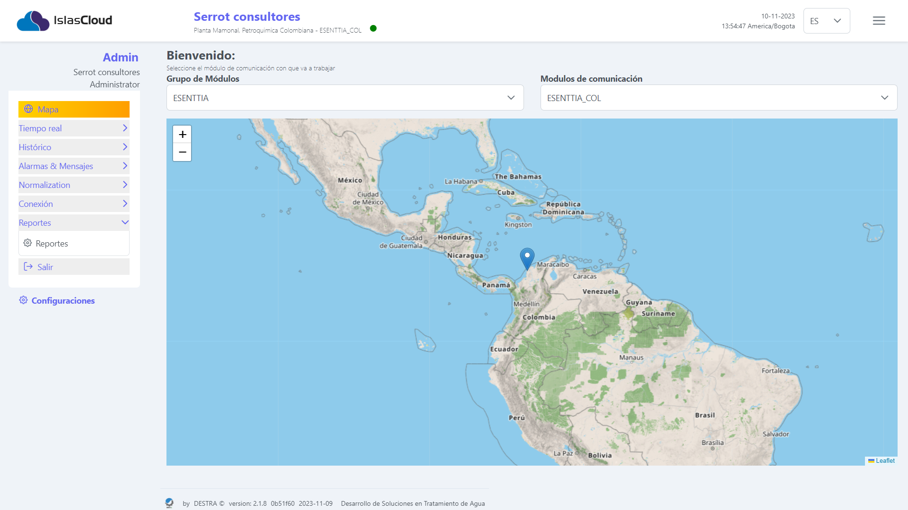
> Este módulo permite al usuario Generar el reporte diario de los procesos del Mcomm. a traves de un formulario se puede llenar dicho, tambien se puede editar, archivar y exportar en formato pdf. 

---

## Listado de reportes
> Este módulo muestra al usuario los registros de los reportes en una tabla, la cuál tiene los siguientes campos: **Nombre, Asunto, Tipos de reportes, Modalidad, Acciones** este campo de acciones tiene a su vez los siguientes elementos: **ver,editar, exportar PDF , archivar**.
---
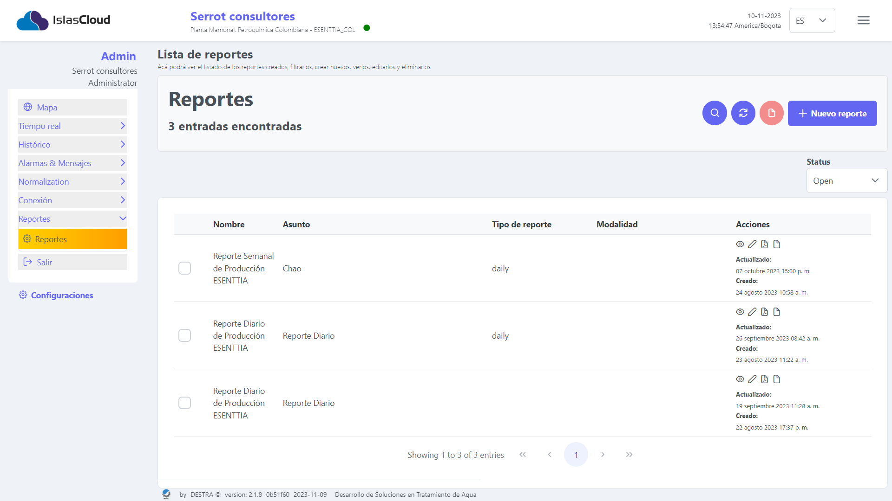
> `Interfaz gráfica del módulo Lista de Reportes`
---
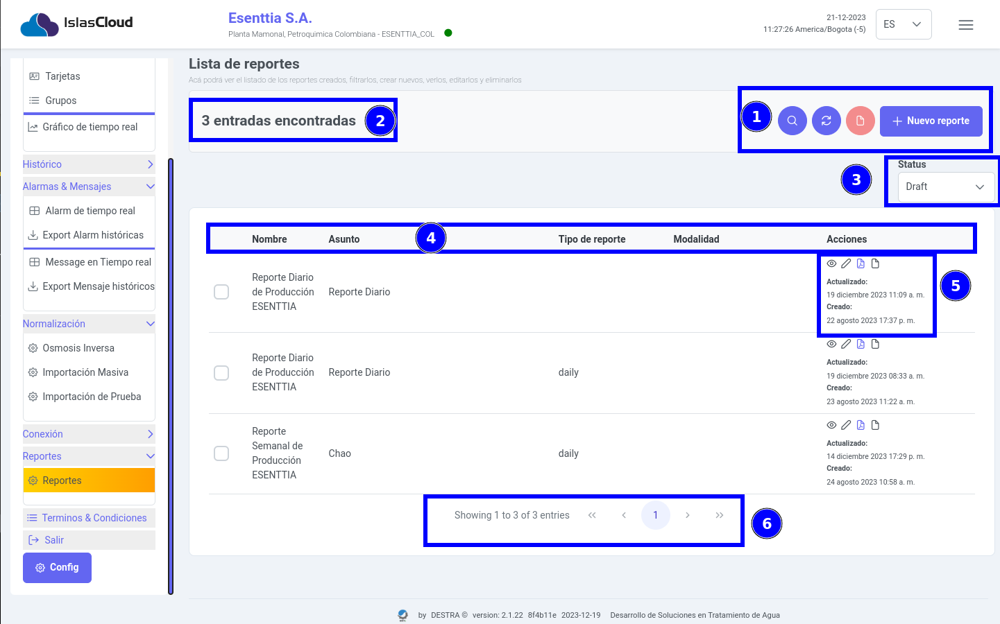
:::tip[Elementos principales de la interfaz gráfica]
**Módulo lista de reportes**, en la imagenes se puede apreciar los elementos resaltantes que se describen a continuación: 1) **Top bar de botones que realizan las siguientes acciones:** `Buscar, actualizar archivar y nuevo reporte`, 2) **Fecha de reinicio**, 3)**Fecha normalizada**,4)**datos**, 5) **Botones de configuración, normalización y Reporte**
:::

---

### Crear Reporte
> Este módulo presenta un formulario en donde el usuario podrá crear un nuevo reporte. **Botón Nueva Ósmosis**: habilita un formulario para registrar los datos de un nuevo proceso de ósmosis; 

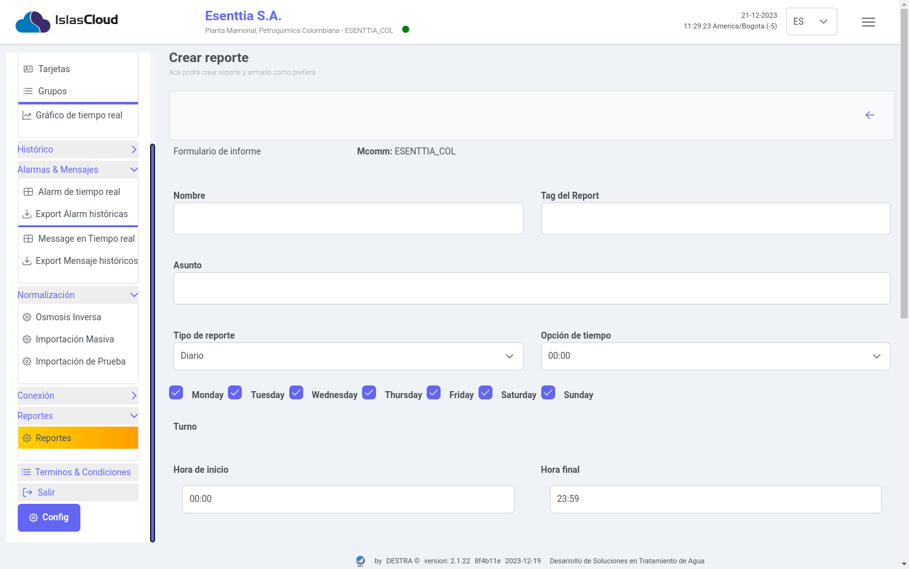

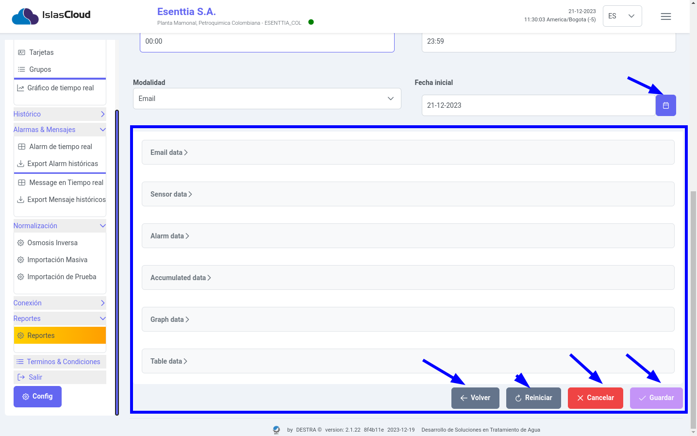
> **`Culminado el llenado del formulario el usuario podra realizar las acciones de guardar o enviar, cancelar el formulario, reiniciar los campos del formulario limpiando los datos y finalmente salir del módulo`**.

---

### Editar Reporte 
> Este módulo presenta un formulario en donde el usuario podrá editar los datos del reporte creado o registrado.

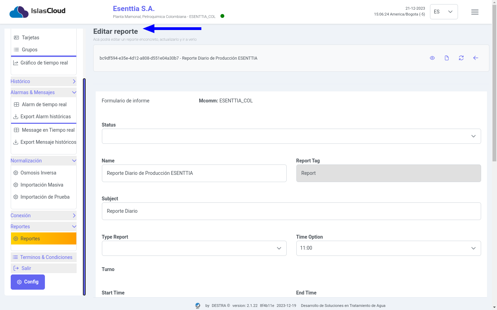

---

### Generar Un Reporte PDF 
> Este ícono permite al usuario exportar el registro del reporte en formato pdf. haciendo click en el mismo.

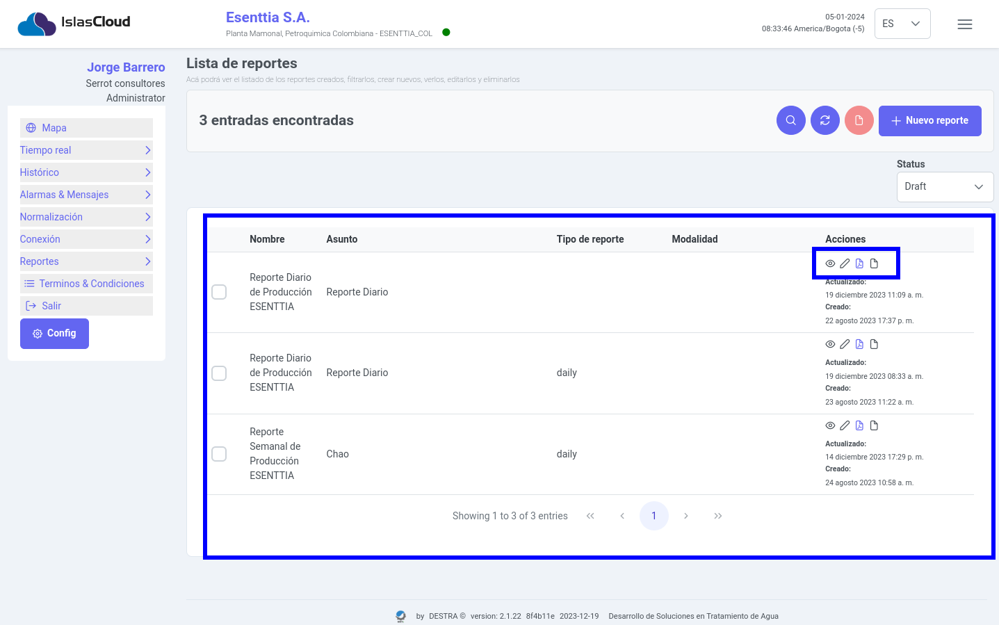

### Guardar Reporte Pdf.
> Al efectuar la exportación del informe a un archivo PDF, el sistema abrirá un cuadro de diálogo que permite al usuario guardar de manera persistente el archivo en formato PDF en su equipo. Este proceso facilita la conservación y acceso posterior al informe generado. 
---

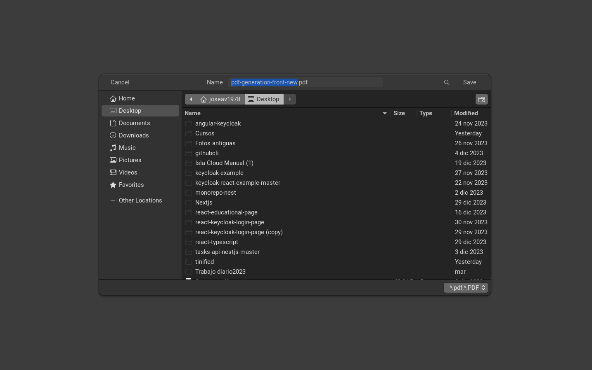

---

### Reporte Generado en PDF
> El usuario ya puede dispones del archivo genrado para su analisis posterior.

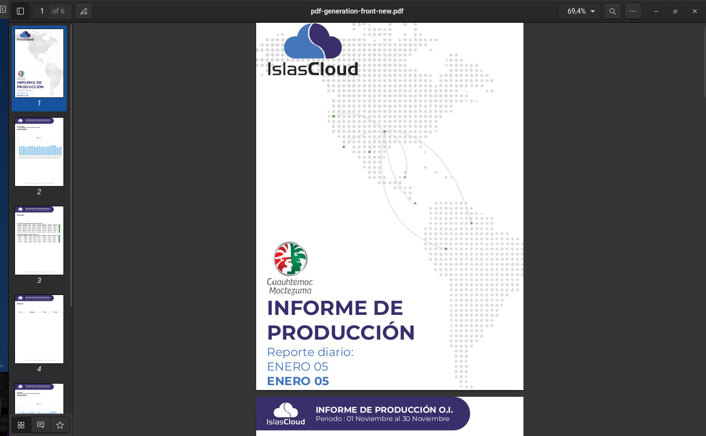

---

---
## Módulo Usuarios 
### Listado de Usuarios
> Este módulo permite  al usuario gestionar el listado de los usuarios del sistema, la información se muestra en la tabla que contiene la siguiente descripción **Name nombre de de pila, lastName:Apellidos  correo electronico: correo del usuario, organización: Nombre de la empresa, Estado: estado activo o inactivo, aciones: botones de las acciones para hacer el CRUD ne el modulo.**

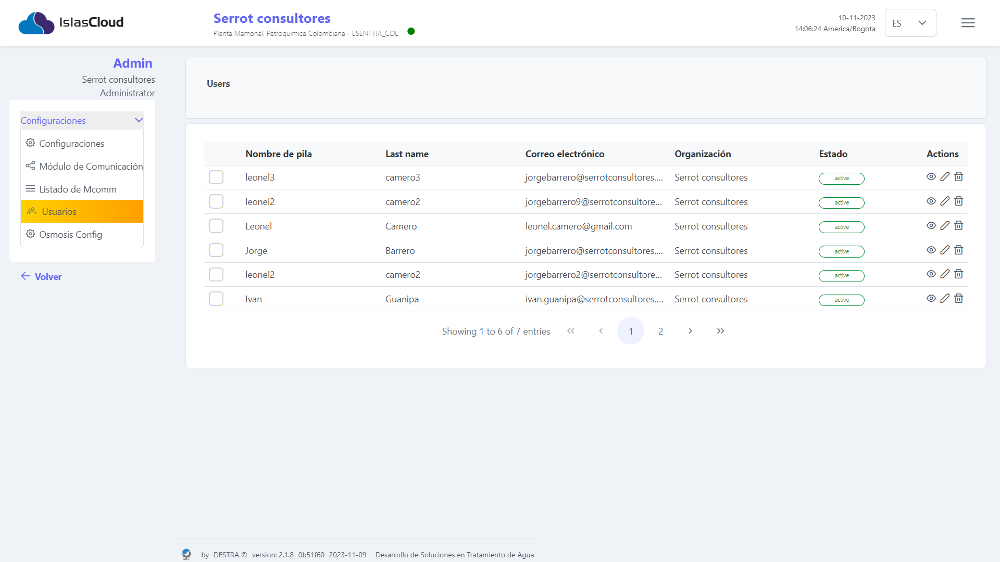
>Interfaz del modulo de usuario, muestra un atabla con la información de los registro de los usuarios del Sistema
---

### Agregar un nuevo Usuario 
> Este módulo permite  registra un nuevo usuario para ingresar al sistema a trave del formulario que se aprecia en la imagen.

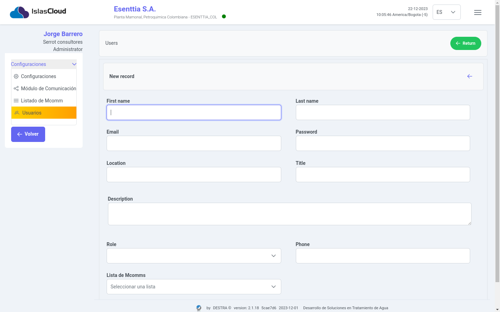

---
### Ver usuarios 
> Este módulo permite  al usuario gestionar el listado de los Mcomm, la información se muestra en la tabla que contiene la siguiente descripción **Name nombre del mcomm, tipo, fecha de creación, status, aciones**
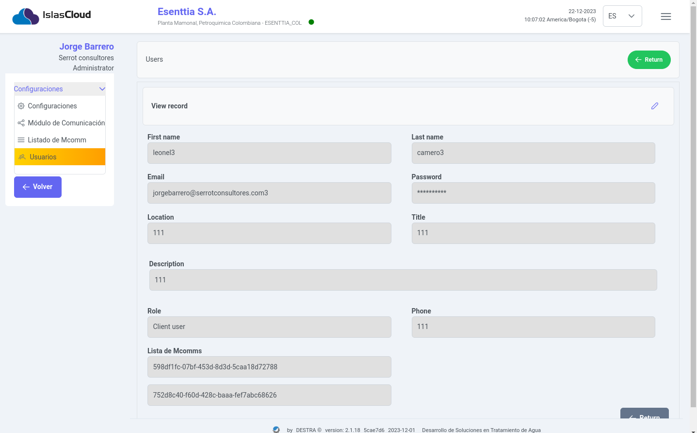

---
### Editar Usuario 
> Este módulo permite  al usuario gestionar la edicion de la información de un usuario

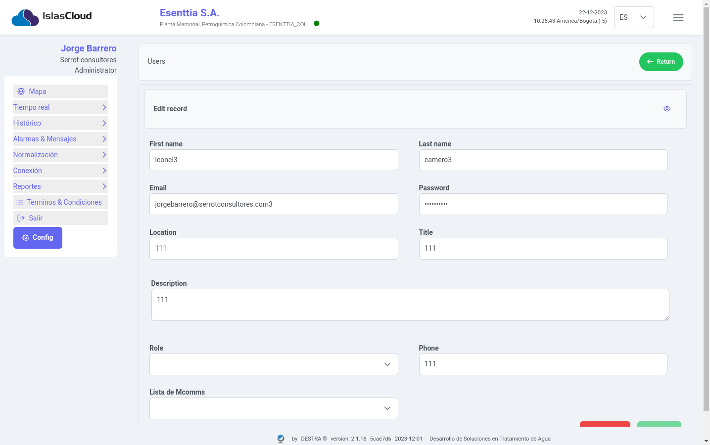

----

### Eliminar Usuario  

> Con este ícono el usuario podra borrar o deshabilitar el registro del usuario que seleccione.
{/* <i className="pi pi-spin pi-spinner" style={{'fontSize': '2em'}}></i> */}