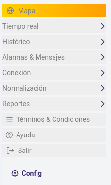

import Highlight from '@site/src/components/Highlight/Highlight';
import 'primeicons/primeicons.css';
import Tabs from '@theme/Tabs';
import { FcMenu } from "react-icons/fc";

import TabItem from '@theme/TabItem';

# Menú Navegación del sistema 

<Highlight color="#666">Menú principal</Highlight>

### Menú de navegación <FcMenu />

> Imagen del Menú de navegación del sistema por módulos. 

### Organización de la estructura de navegación del sistema

:::tip[El menú]

   **El menú de navegación del sistema** permite al usuario acceder a las diferentes funcionalidades del sistema navegando por los módulos principales.

> **El menú principal de navegación del sistema**,` cuenta con los siguientes elementos:`  

1. **Mapa:** Permite visualizar la ubicación geográfica de los elementos del sistema.

2. **Tiempo Real:**

   - **Tablas:** Proporciona una vista tabular de los datos en tiempo real.

   - **Tarjetas:** Muestra datos resumidos en forma de tarjetas.

   - **Grupos:** Agrupa elementos relacionados para su visualización conjunta.

   - **Gráfico de Tiempo Real:** Muestra datos en forma de gráfico en tiempo real.

3. **Histórico:**

   - **Gráficos Históricos:** Permite visualizar datos en forma de gráficos históricos.

   - **Exportar Sensor Histórico:** Permite exportar datos históricos de sensores.

4. **Alarmas & Mensajes:**

   - **Alarmas de Tiempo Real:** Muestra las alarmas activas en tiempo real.

   - **Exportar Alarmas Históricas:** Permite exportar historial de alarmas.

   - **Mensajes en Tiempo Real:** Muestra mensajes activos en tiempo real.

   - **Exportar Mensajes Históricos:** Permite exportar historial de mensajes.

5. **Conexión:** Permite gestionar la conexión del sistema.

6. **Normalización:**

   - **Osmosis Inversa:** Proporciona acceso a la normalización de datos mediante ósmosis inversa.

7. **Reporte:** Accede a la generación de reportes del sistema.

8. **Términos y Condiciones:** Proporciona acceso a los términos y condiciones del sistema.

9. **Ayuda:** Muestra un **formulario de contácto** para que el usuario se contacte con el administrador del sistema por la via email, adicionalmente el sistema tine un boton que enlaza al manual de usuario de la aplicación.

10. **Salir:** Permite cerrar la sesión actual y direcciona al inicio de sessión.

11.   **Configuraciones:**

   - **Configuraciones Generales:** Accede a la configuración general del sistema.

   - **Módulo de Comunicaciones:** Permite configurar el módulo de comunicaciones del sistema.

   - **Listado de Mcomm:** Proporciona acceso al listado de módulos de comunicaciones disponibles.

   - **Usuarios:** Permite gestionar los usuarios del sistema.
:::

