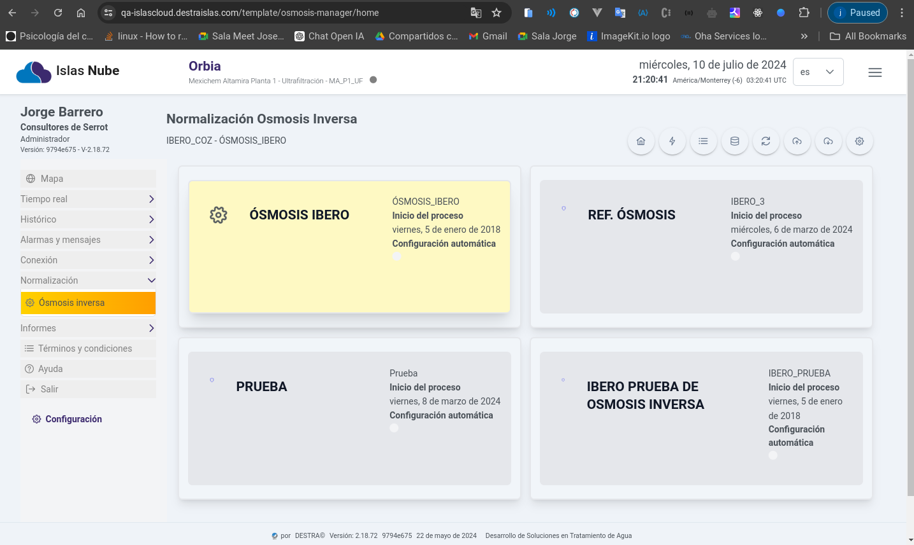
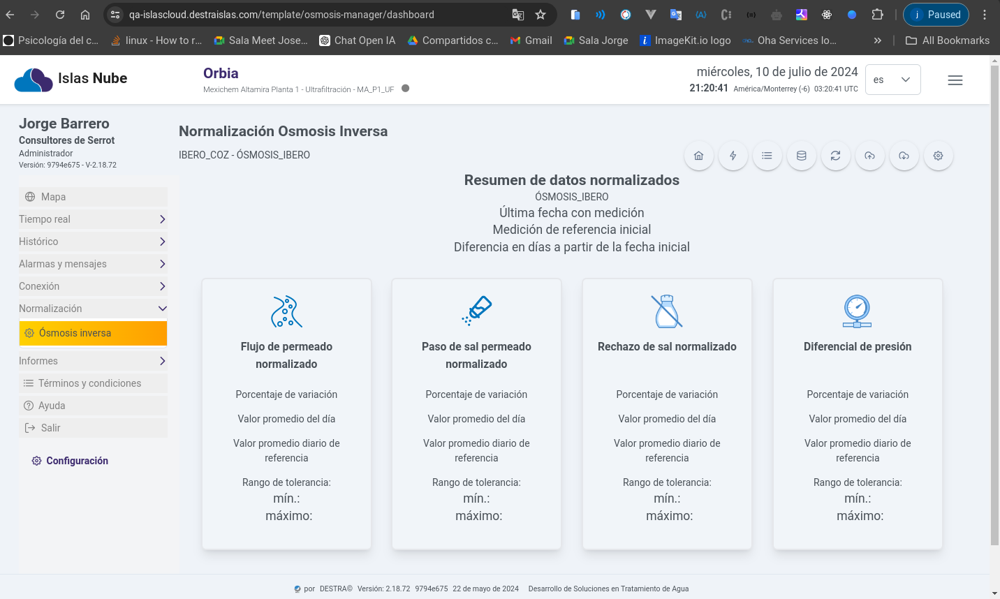
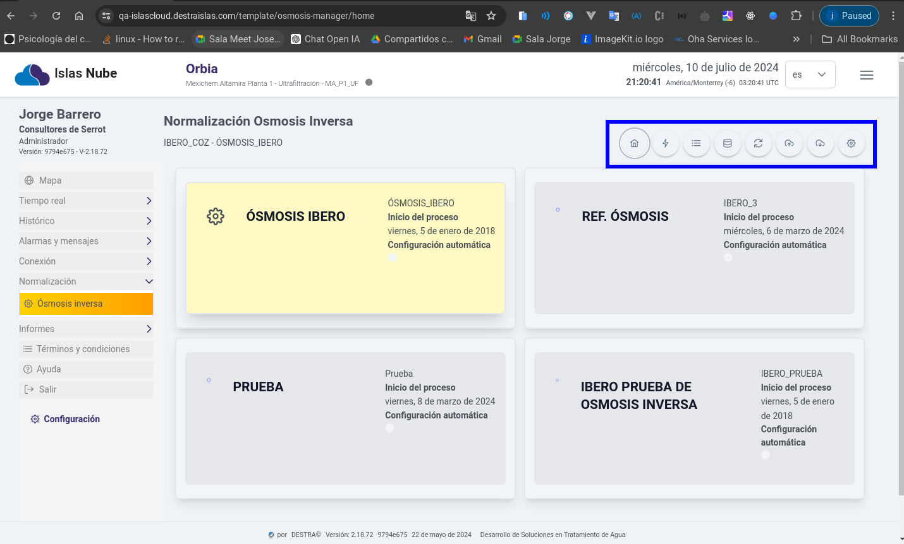
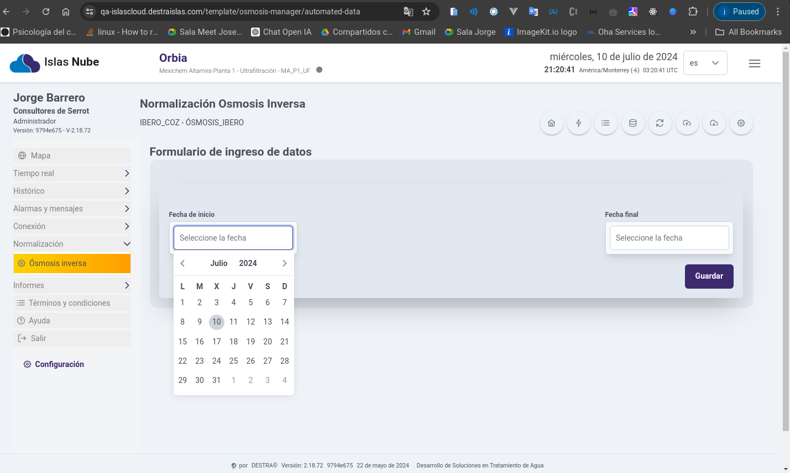

import Highlight from '@site/src/components/Highlight/Highlight';
import 'primeicons/primeicons.css';
import Tabs from '@theme/Tabs';
import { FcMenu } from "react-icons/fc";

import TabItem from '@theme/TabItem';

# Ósmosis Inversa

<Highlight color="#666">Ósmosis</Highlight>

# Módulo Normalización

## Ósmosis Inversa

> Este módulo comprenderá los siguientes elementos: Ósmosis Inversa, Configuración Masiva e Importación de Pruebas.

---

> Este módulo comprenderá los siguientes elementos: Ósmosis Inversa, Configuración Masiva e Importación de Pruebas.

---

> Este módulo comprenderá los siguientes elementos: Ósmosis Inversa, Configuración Masiva e Importación de Pruebas.

> Este módulo comprenderá los siguientes elementos: Ósmosis Inversa, Configuración Masiva e Importación de Pruebas.

