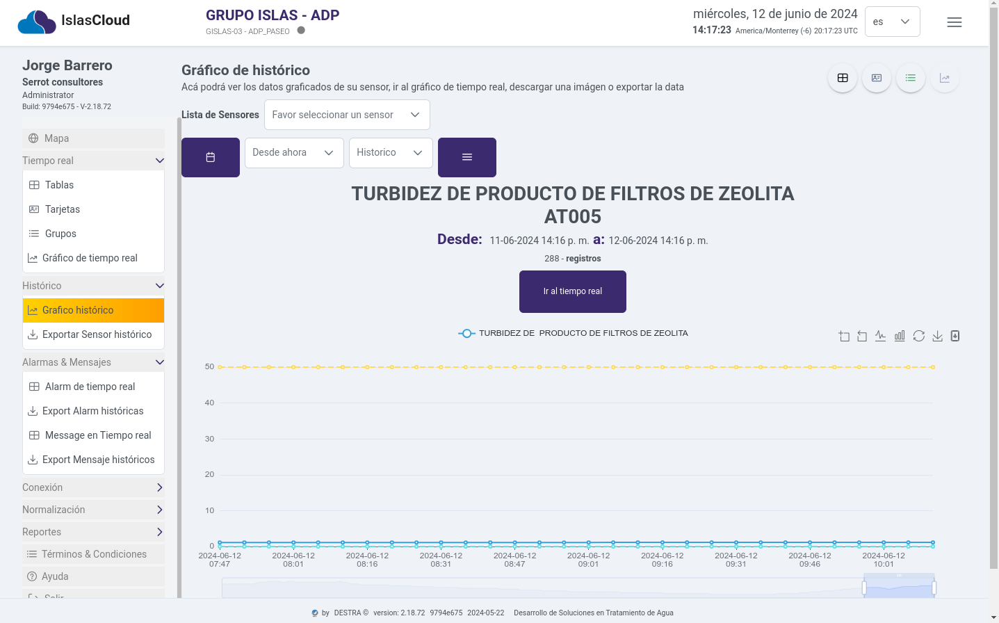
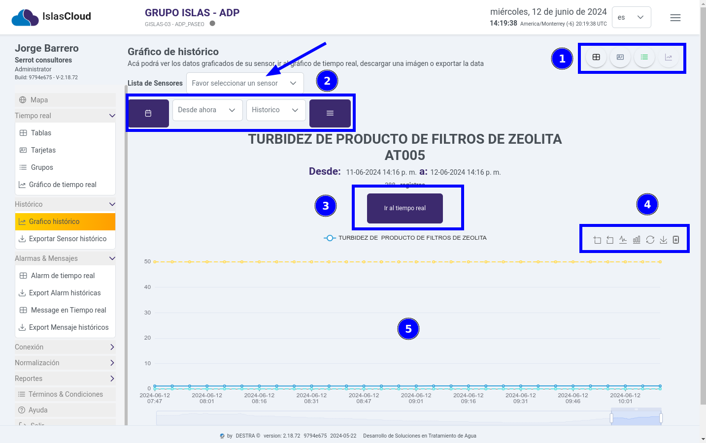
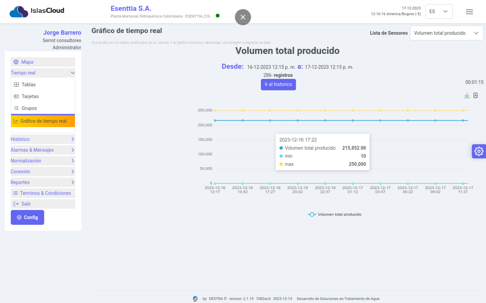

import Highlight from '@site/src/components/Highlight/Highlight';
import 'primeicons/primeicons.css';
import Tabs from '@theme/Tabs';
import { FcMenu } from "react-icons/fc";

import TabItem from '@theme/TabItem';

# Sensores Tiempo Histórico

<Highlight color="#666">Tiempo Histórico</Highlight>

### Módulo Histórico

> En este módulo el usuario podrá observar el comportamiento del sensor, y obtener los datos graficados en tiempo real o historicamente a tráves de un rango de fecha seleccionado, posteriormente tendrá la opción de exportar la data en difentes tipos de formatos **`("Excel", "CSV","TXT","JSON")`** haciendo clic en el ícono  y por útimo podrá descargar la imagen del gráfico en tiempo real o el histórico  haciendo clic al ícono  

> **`Interfaz del módulo Gráfico histórico`**

---

> Elementos del módulo Gráfico histórico **`1) Botones de navegacion a los módulos tablas, tarjeta y grupo  , 2) selección de la lista de sensores y de la fecha en el rango desde ahora hasta histórico, 3) Bontón par ir al módulo tiempo real, 4) Botones para descargar imagen y exportar los datos, 5) Información gráfica del sensor`**

---

>**`Interfaz del gráfico tiempo real donde se muestra la información del sensor`**.

---