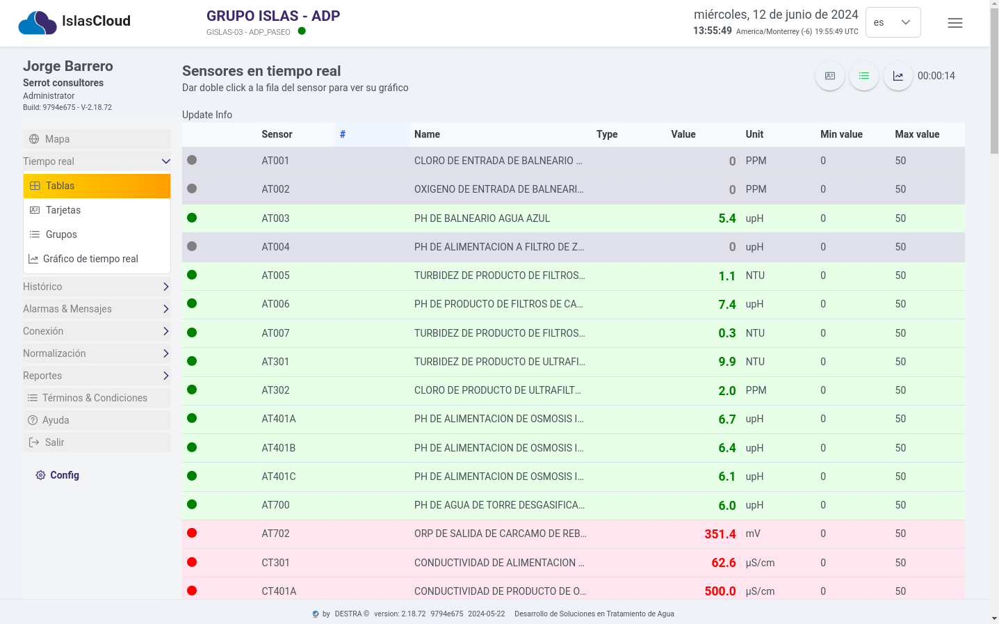
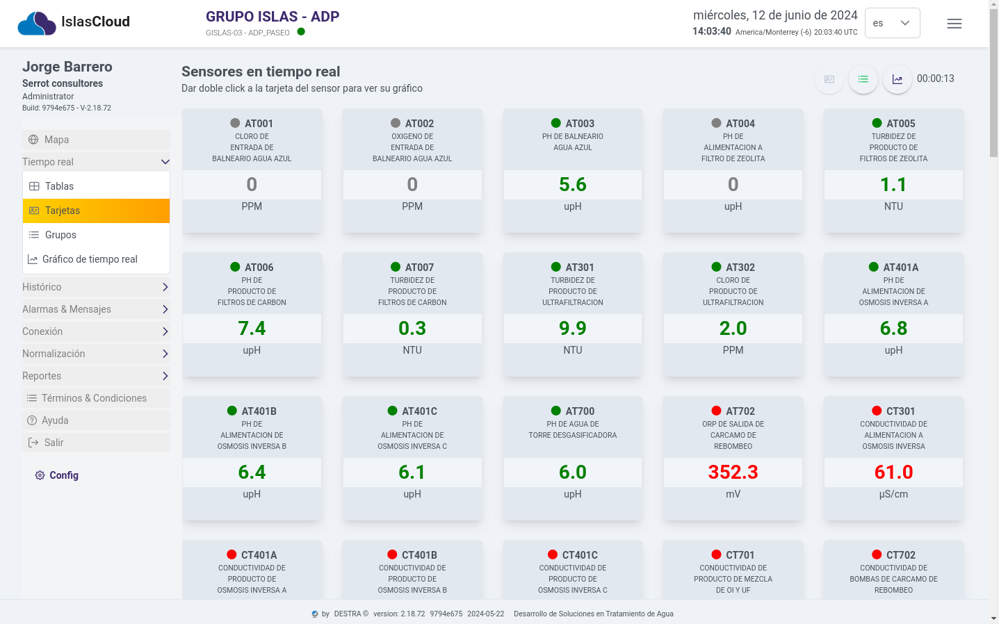
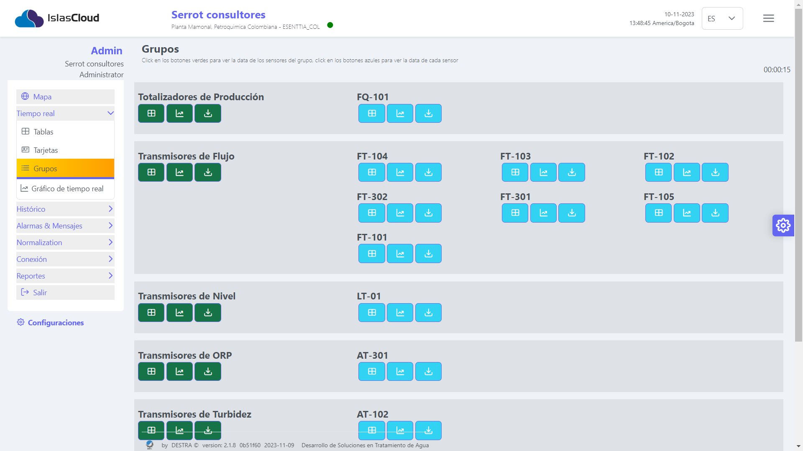
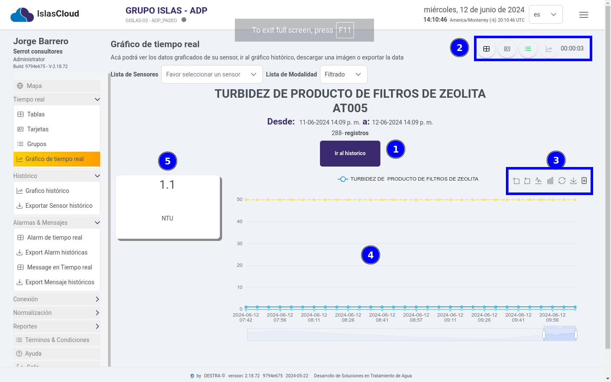

import Highlight from '@site/src/components/Highlight/Highlight';
import 'primeicons/primeicons.css';
import Tabs from '@theme/Tabs';
import { FcMenu } from "react-icons/fc";

import TabItem from '@theme/TabItem';

# Sensores Tiempo Real

<Highlight color="#666">Tiempo real</Highlight>

## Menú Tiempo Real 

:::info
   El Menú de tiempo real permite al usuario visualizar el estado de los sensores en **tiempo real**. el menú esta compuesto de los módulo **Tablas  , Tarjetas , Grupos , Gráfico de tiempo real **
:::

---
### Módulo Tablas  

> Este módulo presenta una tabla con el registro de los sensores en tiempo real, los campos representados  son los siguientes: **`Sensor, #, Name, Type, Value, Unit, Min value, Max Value`**, que describen los datos que estan transmitiendo en  los sensores Mcomm.

> Listado de los sensores que estan transmitiendo información en tiempo real. **`si el usuario selecciona con un clic un sensor de la lista, esta acción hace que se redirecciona a la vista del módulo del gráfico de tiempo real, mostrado el comportamiento del sensor en una gráfica`**.

---

### Módulo Tarjeta  

> Este módulo presenta un Card de los sensores en tiempo real, la información que describe es la siguiente **`Sensor, Nombre,  Value, Unit`.**

> Esta vista **agrupa la informacion de los sensores, a tráves de componentes de tipo card**, mostrando los datos de los sensores con información maś resumida.    

---

### Módulo Grupos  

> Este módulo representa la agrupación de los sensores por tipos de **grupos** como se describe en la imagen **`Totalizadores de Producción,Transmisores de flujos,  Transmisores de nivel, Transmisores de ORP, Transmisores de Turbidez, Transmisores de pH, Transmisores de Conductividad.`**

> Lista desplegable para seleccionar el módulo de comunicación   

---
### Módulo Grafico Tiempo Real  

> En este módulo el usuario  podrá ver los datos graficados del sensor, ir al gráfico histórico, descargar una imágen o exportar la data.

:::info[Gráfico de tiempo real]
En este módulo se muestra la gráfica en tiempo real del sensor, y los elementos destacables de la interfaz se mencionan a continuación, 1) **Botón ir a histórico**, que redirecciona a la vista Histórico,  2) **lista de sensores**, el usurio podrá seleccionar el sensor que quiera analizar, 3) **El tiempo real** de la lectura del sensor, con las opciones de hacer zoom, reset el zoom, cambiar el gráfico a line chart, cambiar a gráfico de barra, restaurar el gráfico, exportar la data y descargar la imagen del gráfico, 4) **representación visual del grafico con sus metrícas**, 5) **Card con la información del sensor su unidad de medida y el valor producido**.
:::

---
