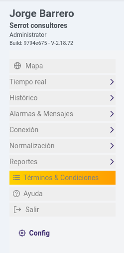
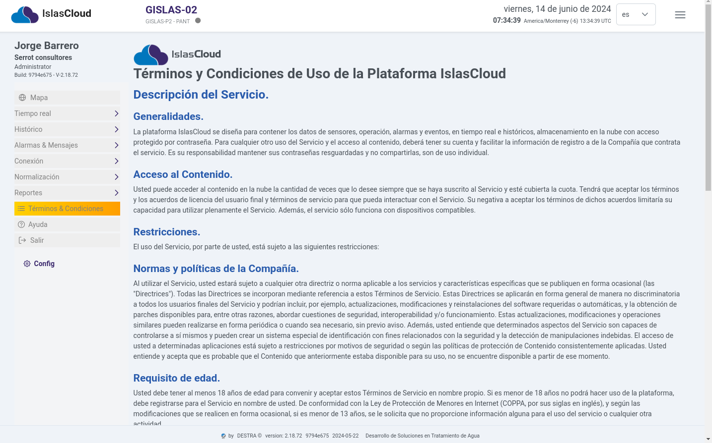

import Highlight from '@site/src/components/Highlight/Highlight';
import 'primeicons/primeicons.css';
import Tabs from '@theme/Tabs';
import { FcMenu } from "react-icons/fc";

import TabItem from '@theme/TabItem';

# Términos & Condiciones

<Highlight color="#666">Términos & Condiciones</Highlight>
## Modulo Términos y condiciones

  
Mostrar

  
  

:::info Términos y Condiciones de Uso de la Plataforma IslasCloud

### Descripción del Servicio.
### Generalidades.
>La plataforma IslasCloud se diseña para contener los datos de sensores, operación, alarmas y eventos, en tiempo real e históricos, almacenamiento en la nube con acceso protegido por contraseña. Para cualquier otro uso del Servicio y el acceso al contenido, deberá tener su cuenta y facilitar la información de registro a de la Compañía que contrata el servicio. Es su responsabilidad mantener sus contraseñas resguardadas y no compartirlas, son de uso individual.

### Acceso al Contenido.
>Usted puede acceder al contenido en la nube la cantidad de veces que lo desee siempre que se haya suscrito al Servicio y esté cubierta la cuota. Tendrá que aceptar los términos y los acuerdos de licencia del usuario final y términos de servicio para que pueda interactuar con el Servicio. Su negativa a aceptar los términos de dichos acuerdos limitaría su capacidad para utilizar plenamente el Servicio. Además, el servicio sólo funciona con dispositivos compatibles.

### Restricciones.
> El uso del Servicio, por parte de usted, está sujeto a las siguientes restricciones:

### Normas y políticas de la Compañía.
>Al utilizar el Servicio, usted estará sujeto a cualquier otra directriz o norma aplicable a los servicios y características específicas que se publiquen en forma ocasional (las "Directrices"). Todas las Directrices se incorporan mediante referencia a estos Términos de Servicio. Estas Directrices se aplicarán en forma general de manera no discriminatoria a todos los usuarios finales del Servicio y podrían incluir, por ejemplo, actualizaciones, modificaciones y reinstalaciones del software requeridas o automáticas, y la obtención de parches disponibles para, entre otras razones, abordar cuestiones de seguridad, interoperabilidad y/o funcionamiento. Estas actualizaciones, modificaciones y operaciones similares pueden realizarse en forma periódica o cuando sea necesario, sin previo aviso. Además, usted entiende que determinados aspectos del Servicio son capaces de controlarse a sí mismos y pueden crear un sistema especial de identificación con fines relacionados con la seguridad y la detección de manipulaciones indebidas. El acceso de usted a determinadas aplicaciones está sujeto a restricciones por motivos de seguridad o según las políticas de protección de Contenido consistentemente aplicadas. Usted entiende y acepta que es probable que el Contenido que anteriormente estaba disponible para su uso, no se encuentre disponible a partir de ese momento.

### Requisito de edad.
>Usted debe tener al menos 18 años de edad para convenir y aceptar estos Términos de Servicio en nombre propio. Si es menor de 18 años no podrá hacer uso de la plataforma, debe registrarse para el Servicio en nombre de usted. De conformidad con la Ley de Protección de Menores en Internet (COPPA, por sus siglas en inglés), y según las modificaciones que se realicen en forma ocasional, si es menor de 13 años, se le solicita que no proporcione información alguna para el uso del servicio o cualquier otra actividad.

### Conducta prohibida.
>Usted no utilizará el Servicio para transmitir, mostrar, ejecutar o de algún modo poner a disposición mensajes, contenidos o materiales (i) que sean ilegales, obscenos, amenazantes, masivos no solicitados o "spam", difamatorios, invasores de la privacidad, o (ii) que violen o infrinjan derechos de autor, marcas registradas, patentes, secretos comerciales y otros derechos de propiedad intelectual, derechos de privacidad o publicidad, reglamentos o estatutos de comunicaciones, o cualesquiera otras leyes, incluyendo, sin limitación, las leyes sobre difamación, acoso, obscenidad y pornografía; (iii) que constituyan campañas políticas o solicitudes de venta o marketing o que contengan virus informáticos u otro código de computadora destinado a interferir con la funcionalidad de los sistemas de computadoras, o (iv) que de alguna manera perjudiquen a los menores. Usted conviene no interrumpir ni intentar interrumpir la operación o el Servicio de ninguna manera. Durante el uso se espera se comporten de una manera adecuada y respetuosa, teniendo en cuenta un alto estándar de educación. Cualquier violación a lo aquí dispuesto, estará sujeta a la revisión y las acciones pertinentes que la Compañía decida adoptar, a su sola consideración e inclusive proceder al derecho de Terminar el Servicio. Además, no podrá utilizar una dirección de correo electrónico falsa o de algún modo engañar a otros miembros en cuanto a su identidad o al origen de un mensaje o contenido.

### Restricción sobre el uso relacionado con el Servicio.
> El Servicio incluye componentes de seguridad por lo que se aplican normas y políticas especiales. Usted no deberá intentar (ni apoyar los intentos de otros) eludir, aplicar ingeniería inversa, descifrar, descompilar, desmontar o de algún modo modificar, alterar o interferir con ningún aspecto del Servicio. Usted no podrá distribuir, intercambiar, modificar, vender o revender, o transmitir a cualquier otra persona cualquier parte del Servicio, incluyendo, sin limitación, cualquier texto, imagen o audio, para cualquier propósito empresarial, comercial o público. Usted conviene en no copiar, vender, distribuir o de algún modo transferir Contenido, salvo del modo expresamente permitido en el presente.

### Cargos y facturación.
### Acuerdo de pago.
>Usted acepta pagar por todo el Contenido y servicio. El Usuario otorga su consentimiento para comience la prestación del Servicio pactado una vez reciba la confirmación del pago

### Precio total.
>El servicio ofertado incluye todos los impuestos, costos y gastos que deba pagar el consumidor para adquirirlo. Por lo cual el Usuario debe revisar el precio antes de proceder al pago.

### Terminación.
>Nos reservamos el derecho a dar por terminada su Cuenta y/o el acceso por parte de usted al Servicio si infringe cualquiera de los Términos de Servicio. Si se diera por terminado su membresía y suscripción(s) al Servicio, no serán reembolsables las cuotas ni los cargos.

### Impuestos.
>Las compras en el Servicio pueden incluir el impuesto sobre ventas o el impuesto al valor agregado (cuando proceda) y dicho impuesto se basará en la mejor información disponible acerca de su dirección. En tales casos, se aplicará el tipo impositivo que esté en vigor en el momento en que se realicen las compras en el Servicio. Si cambia el tipo impositivo aplicable a las ventas antes de finalizar las compras correspondientes, se aplicará el nuevo tipo impositivo que esté en vigor en el momento de concretar la compra en el Servicio. Podrían aplicarse otras limitaciones y renuncias a la responsabilidad sobre productos y servicios. Usted será el único responsable de pagar la totalidad de dichos impuestos.

### Derecho al cambio de precios
>Todos los precios relacionados con el Servicio están sujetos a cambios en cualquier momento, sin previo aviso y sin responsabilidad alguna hacia el Usuario. No ofrecemos una protección de precios o reembolsos en caso de una caída de precios o una oferta promocional. Se presentará el precio total al momento de pagar.

### Pagos.
>Se realizará el pago del servicio por transferencia bancaria o cheque en moneda nacional una vez generada la factura correspondiente a partir de la confirmación de la transferencia o depósito, la entidad bancaria contará con los tiempos dispuestos según sus políticas internas. El Usuario deberá sujetarse a los términos de duración del proceso de aplicación estipulado por su banco.

### Reembolsos.
>Salvo disposición legal contraria, los pagos realizados no son reembolsables en ninguna circunstancia. El Usuario deberá sujetarse a los términos de duración del proceso de aplicación estipulados bien sea por su banco.

:::

--- 