import Highlight from '@site/src/components/Highlight/Highlight';
import 'primeicons/primeicons.css';
import Tabs from '@theme/Tabs';

import TabItem from '@theme/TabItem';

# Usuarios 👥

<Highlight color="#666">Usuarios del Sistema</Highlight>

## Bienvenidos al Sistema

> Bienvenidos al sistema de Reportería  de **`IslasCloud`**.

 :::info[INFO]
   
   `La navegación a través del menú de los diversos módulos del sistema y las pantallas de la interfaz es uniforme para todos los usuarios`. Sin embargo, cabe destacar que únicamente los usuarios con roles de Administrador (Admin) y Tecnología de la Información (IT) tienen privilegios de acceso a los módulos de **Usuario** y **Configuración**. Esta distinción se aplica exclusivamente en el contexto de la interfaz del usuario.
 :::

:::tip[Usuario del Sistema]

<Tabs>
  <TabItem value="admin" label="Admin">El usuario **Admin** tiene acceso a todos los módulos del sistema.tiene la capacidad para gestionar usuarios, configuraciones de los sensores</TabItem>
  <TabItem value="clientmanager" label="Client Manager">El usuario **Client Manager** tiene priviliegios limitados. </TabItem>
  <TabItem value="clientuser" label="Client User">El usuario **Client User** tiene acceso a todos los módulos del sistema. excepto Usuario y configuraciones.</TabItem>
  <TabItem value="corporatemanager" label="Corporate Manager">tiene acceso a todos los módulos del sistema. excepto Usuario y configuraciones.</TabItem>
  <TabItem value="userit" label="Information technology">El usuario **It** tiene acceso a todos los módulos del sistema.tiene la capacidad para gestionar usuarios, configuraciones de los sensores.</TabItem>
</Tabs>
 :::

### Dashboard Principal - Mapa 

> **Interfaz del Dasboard Principal**, esta compuesta con los siguientes elementos, menú de navegación hacia los diferentes módulos, dos listas desplegables, la primera **Grupos de módulos** que permite seleccionar el grupo de módulos de comunicaciones, el segundo **Módulos de cominicación** que permite seleccionar el **módulo de comunicaciones - Sensores**.

---
### Grupo de Módulos

> **Lista desplegable para seleccionar El grupo de módulos**  
---
### Módulos de comunicación

> **Lista desplegable para seleccionar el módulo de comunicación**   

---

:::info
Al momento de seleccionar  con un clic el ícono de **gps**, redireccionaa a la vista **Tiempo Real Tablas**, interfaz que muestra  el listado de los sensores de manera detallada.
:::  

---
### Cambio de idioma 
> Para cambiar el idioma del sistema, seleccione la lista desplegable (dropdown) de **idioma** y seleccione el idioma que desea utilizar.

:::info
Al momento de seleccionar  con un clic la lista desplegable se  cambia el idioma de la interfaz del sistema. **Solo se puede cambiar al idioma inglés o español**.
::: 

---
### Menú de navegación
> Menú de navegación del sistema.

:::info
   **El menú de navegación del sistema** permite al usuario acceder a las diferentes funcionalidades del sistema.

> **`El menú principal de navegación del sistema**, cuenta con los siguientes elementos:`**  

1. **Mapa:** Permite visualizar la ubicación geográfica de los elementos del sistema.

2. **Tiempo Real:**

   - **Tablas:** Proporciona una vista tabular de los datos en tiempo real.

   - **Tarjetas:** Muestra datos resumidos en forma de tarjetas.

   - **Grupos:** Agrupa elementos relacionados para su visualización conjunta.

   - **Gráfico de Tiempo Real:** Muestra datos en forma de gráfico en tiempo real.

3. **Histórico:**

   - **Gráficos Históricos:** Permite visualizar datos en forma de gráficos históricos.

   - **Exportar Sensor Histórico:** Permite exportar datos históricos de sensores.

4. **Alarmas & Mensajes:**

   - **Alarmas de Tiempo Real:** Muestra las alarmas activas en tiempo real.

   - **Exportar Alarmas Históricas:** Permite exportar historial de alarmas.

   - **Mensajes en Tiempo Real:** Muestra mensajes activos en tiempo real.

   - **Exportar Mensajes Históricos:** Permite exportar historial de mensajes.

5. **Normalización:**

   - **Osmosis Inversa:** Proporciona acceso a la normalización de datos mediante ósmosis inversa.

   - **Importación Masiva:** Permite realizar importaciones masivas de datos.

6. **Conexión:** Permite gestionar la conexión del sistema.

7. **Reporte:** Accede a la generación de reportes del sistema.

8. **Términos y Condiciones:** Proporciona acceso a los términos y condiciones del sistema.

9. **Salir:** Permite cerrar la sesión actual.

10.   **Configuraciones:**

   - **Configuraciones Generales:** Accede a la configuración general del sistema.

   - **Módulo de Comunicaciones:** Permite configurar el módulo de comunicaciones del sistema.

   - **Listado de Mcomm:** Proporciona acceso al listado de módulos de comunicaciones disponibles.

   - **Usuarios:** Permite gestionar los usuarios del sistema.

:::

> **`Organización de la estructura de navegación del sistema`**

----

## Menú Tiempo Real

:::info
   El Menú de tiempo real permite al usuario visualizar el estado de los sensores en **tiempo real**. el menú esta compuesto de los módulo **Tablas  , Tarjetas , Grupos , Gráfico de tiempo real **
:::
---
### Módulo Tablas  

> Este módulo presenta una tabla con el registro de los sensores en tiempo real, los campos representados  son los siguientes: **`Sensor, #, Name, Type, Value, Unit, Min value, Max Value`**, que describen los datos que estan transmitiendo en  los sensores Mcomm.

> Listado de los sensores que estan transmitiendo información en tiempo real. **`si el usuario selecciona con un clic un sensor de la lista, esta acción hace que se redirecciona a la vista del módulo del gráfico de tiempo real, mostrado el comportamiento del sensor en una gráfica`**.

---

### Módulo Tarjeta  

> Este módulo presenta un Card de los sensores en tiempo real, la información que describe es la siguiente **`Sensor, Nombre,  Value, Unit`.**

> Esta vista **agrupa la informacion de los sensores, a tráves de componentes de tipo card**, mostrando los datos de los sensores con información maś resumida.    

---

### Módulo Grupos  

> Este módulo representa la agrupación de los sensores por tipos de **grupos** como se describe en la imagen **`Totalizadores de Producción,Transmisores de flujos,  Transmisores de nivel, Transmisores de ORP, Transmisores de Turbidez, Transmisores de pH, Transmisores de Conductividad.`**

> Lista desplegable para seleccionar el módulo de comunicación   

---
### Módulo Grafico Tiempo Real  

> En este módulo el usuario  podrá ver los datos graficados del sensor, ir al gráfico histórico, descargar una imágen o exportar la data.

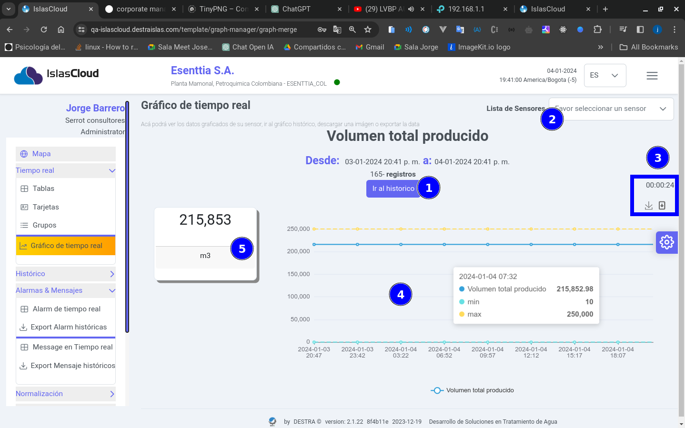

:::info[Gráfico de tiempo real]
En este módulo se muestra la gráfica en tiempo real del sensor, y los elementos destacables de la interfaz se mencionan a continuación, 1) **Botón ir a histórico**, que redirecciona a la vista Histórico,  2) **lista de sensores**, el usurio podrá seleccionar el sensor que quiera analizar, 3) **El tiempo real** de la lectura del sensor, con las opciones de exportar la data y descargar la imagen del gráfico, 4) **representación visual del grafico con sus metrícas**, 5) **Card con la información del sensor su unidad de medida y el valor producido**.
:::

---
### Módulo Histórico
> En este módulo el usuario podrá observar el comportamiento del sensor, y obtener los datos graficados en tiempo real o historicamente a tráves de un rango de fecha seleccionado, posteriormente tendrá la opción de exportar la data en difentes tipos de formatos **`("Excel", "CSV","TXT","JSON")`** haciendo clic en el ícono  y por útimo podrá descargar la imagen del gráfico en tiempo real o el histórico  haciendo clic al ícono  

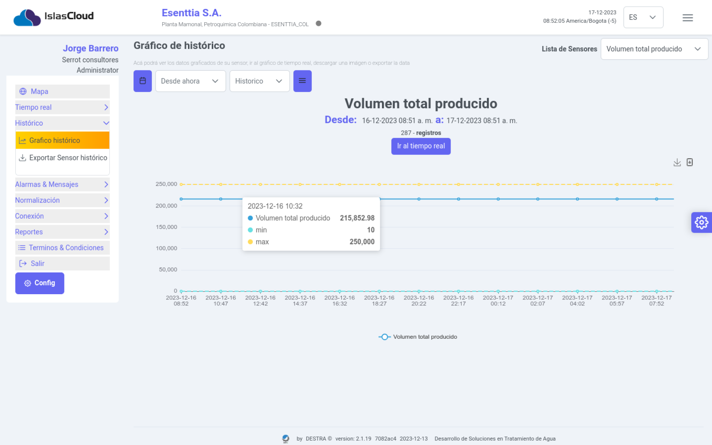
> **`Interfaz del módulo Gráfico histórico`**
---

> Elementos del módulo Gráfico histórico **`1) Lista de los sensores, 2) selección de la fecha en rango desde ahora hasta histórico, 3) Bontón par ir al módulo tiempo real, 4) Botones para descargar imagen y exportar los datos, 5) Información gráfica del sensor`** 
---

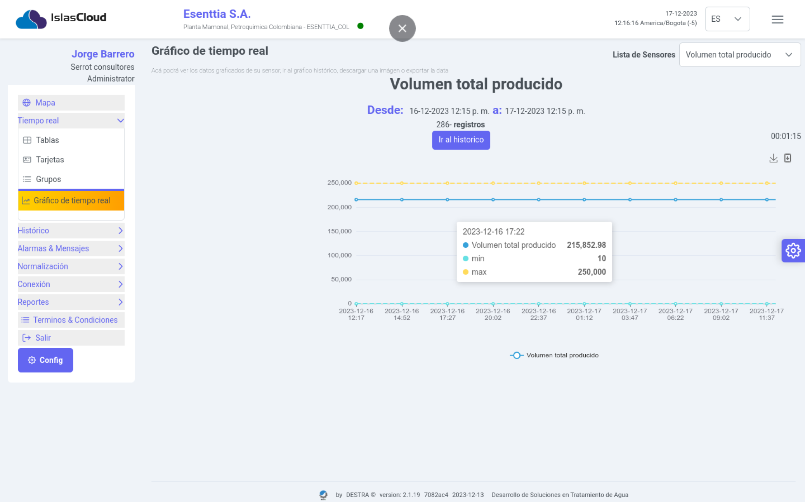
>**`Interfaz del módulo tiempo real`**.
---

## Módulo Alarmas & Mensajes

### Alarmas tiempo real
> El módulo de **Alarmas**  tiene como función principal la visualización en tiempo real de las alarmas provenientes de diversos sensores, llevando un registro histórico de las mismas.

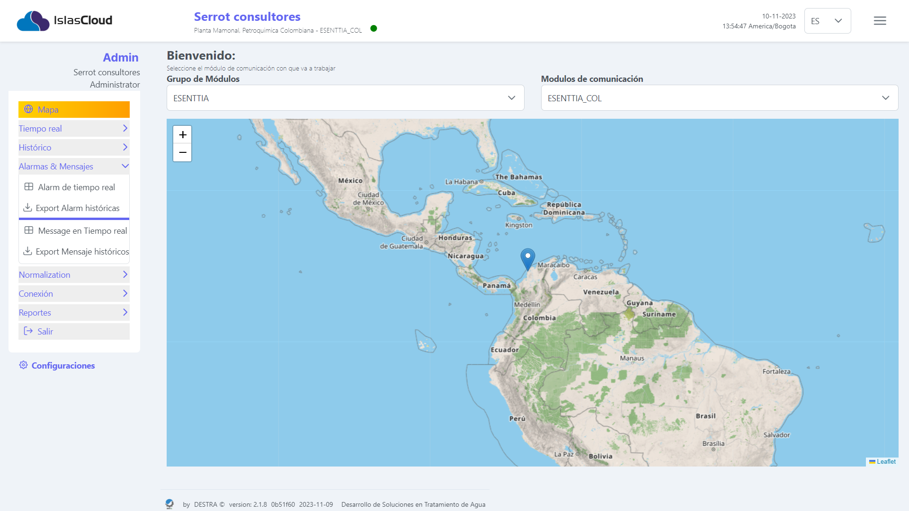

> **Esa tabla permitiría tener un registro histórico de todas las alarmas ocurridas, conocer cuáles están aún activas y tener la información necesaria para que un operador pueda evaluar y atender la situación que la provocó.**

---
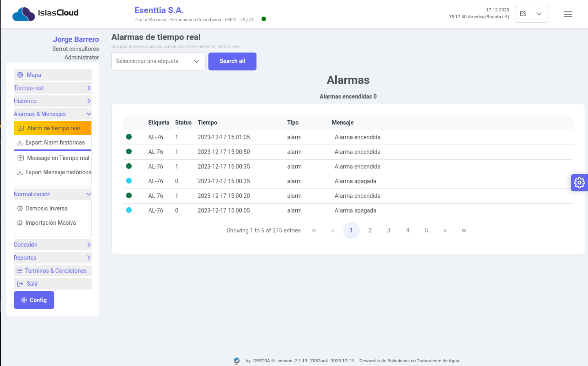

:::note Nota

>La información Cada alarma queda almacenada en una tabla con los siguientes campos:

- Etiqueta **Nombre del sensor**
- Estatus **(activa/inactiva)**
- Tiempo **Fecha y hora cuando se activó la alarma**
- Tipo **Identificador del tipo de alarma**
- Mensaje **Descripción textual de la alarma**

:::

---

### Exportar Alarmas

> El módulo de exportar alarmas  tiene como función principal de configurar y exportar la data de las alarmas.

> Interfaz del módulo de exportar alrmas
---

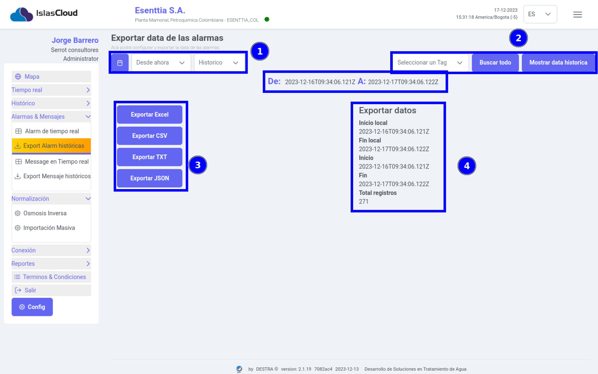

> Elementos principales del módulo exportar data de las alarmas.

:::info[]
1. Botón de selección de **fecha**, lista desplegable **desde ahora, Histórico**.
2. Lista desplegable **Seleccionar un tag**, y botones **Buscar todo, mostrar data histórica**.
3. Botones **Exportar Excel**,**Exportar CSV**,**Exportar TXT**,**Exportar JSON**
4. **Descripción de exportar datos**

:::
----

### Mensajes tiempo real

> El módulo de **Mensajes**  tiene como función principal la visualización en tiempo real de los mensajes provenientes de los sensores, llevando un registro histórico de las mismas.

:::note Nota

>La información Cada alarma queda almacenada en una tabla con los siguientes campos:

- Etiqueta **Nombre del sensor**
- Estatus **(activa/inactiva)**
- Tiempo **Fecha y hora cuando se activó la alarma**
- Tipo **Identificador del tipo de alarma**
- Mensaje **Descripción textual de la alarma**

:::

---
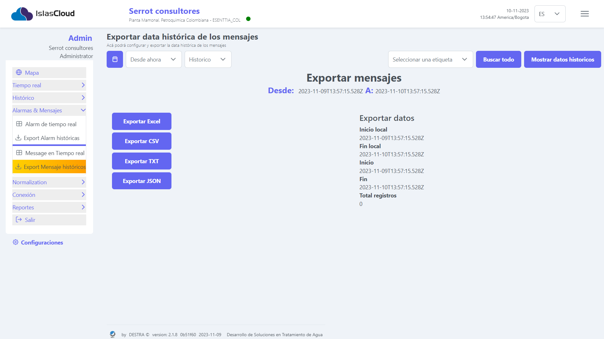
> Elementos principales del módulo exportar data de las alarmas.

---

> Elementos principales del módulo exportar data de las alarmas.

---

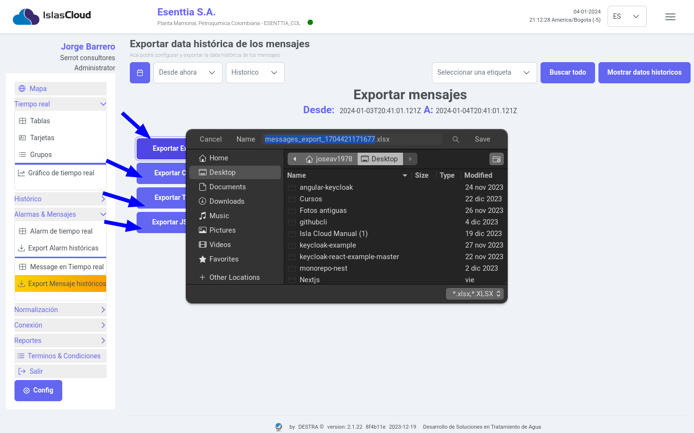
> Elementos principales del módulo exportar data de las alarmas.al seleccionar algunos de los botones para realizar la exportación del archivo del reporte historico de las alarma muestra el siguiente cuadro de dialogo para guardar la información en el equipo.

:::info[]
1. Botón de selección de **fecha**, lista desplegable **desde ahora, Histórico**.
2. Lista desplegable **Seleccionar un tag**, y botones **Buscar todo, mostrar data histórica**.
3. Botones **Exportar Excel**,**Exportar CSV**,**Exportar TXT**,**Exportar JSON**
4. **Descripción de exportar datos**

:::

---
# Módulo Normalización

## Ósmosis Inversa

> Este módulo comprenderá los siguientes elementos: Ósmosis Inversa, Configuración Masiva e Importación de Pruebas.

---
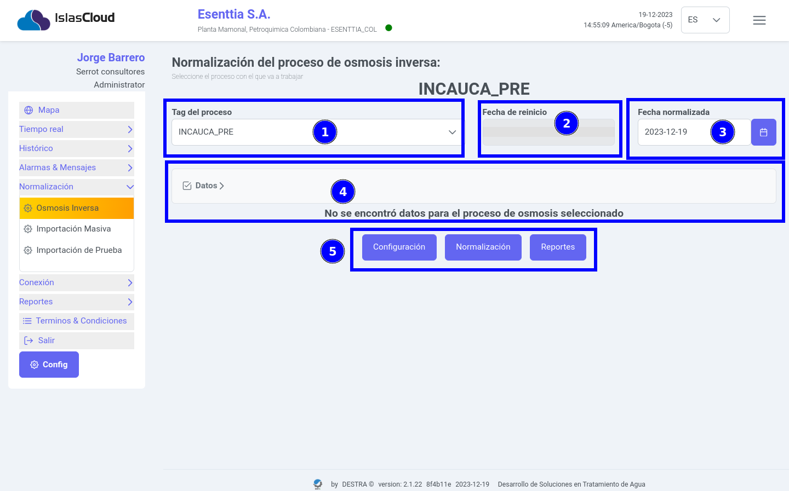

:::tip
**Módulo de Ósmosis Inversa**, en la imagenes se puede apreciar los elementos resaltantes que se describen a continuación: 1) **Tag del proceso**, 2) **Fecha de reinicio**, 3)**Fecha normalizada**,4)**datos**, 5) **Botones de configuración, normalización y Reporte**
:::

---
### Configuración de proceso de Ósmosis inversa
> Este módulo permite configurar los parámetros de la ósmosis inversa.

> Listado de procesos OI para ESSTIA_COL

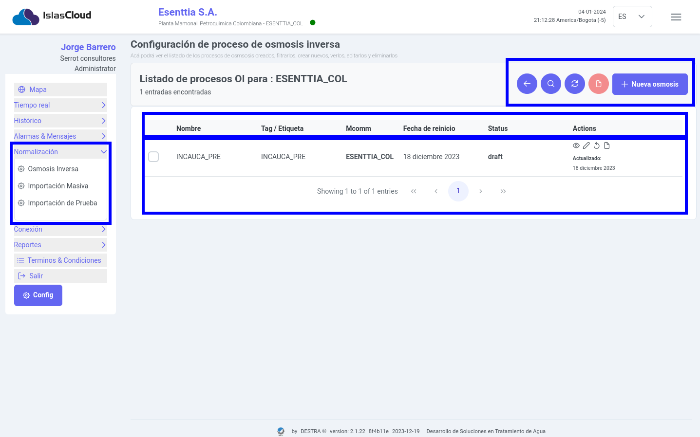

>Elementos visuales de la interfaz del módulo ósmosis Inversa:
**Botón regresar** direcciona al usuario a la vista listado de procesos de ósmosis

**Botón buscar Filtrar**: habilita una ventana para filtrar los datos del proceso de ósmosis; 

**Botón Refrescar**: Limpia los datos de la tabla y los carga de nuevo; 

**Botón Archivar**: Guarda o desabilita el registro de la tabla; 

**Botón Nueva Ósmosis**: habilita un formulario para registrar los datos de un nuevo proceso de ósmosis; 

---

### Creación de nuevo proceso de Ósmosis
> Este módulo muestra un formulario para el registro de un nuevo proceso de ósmosis inversa.
---

> Formulario Para crear un nuevo proceso de ósmosis

---
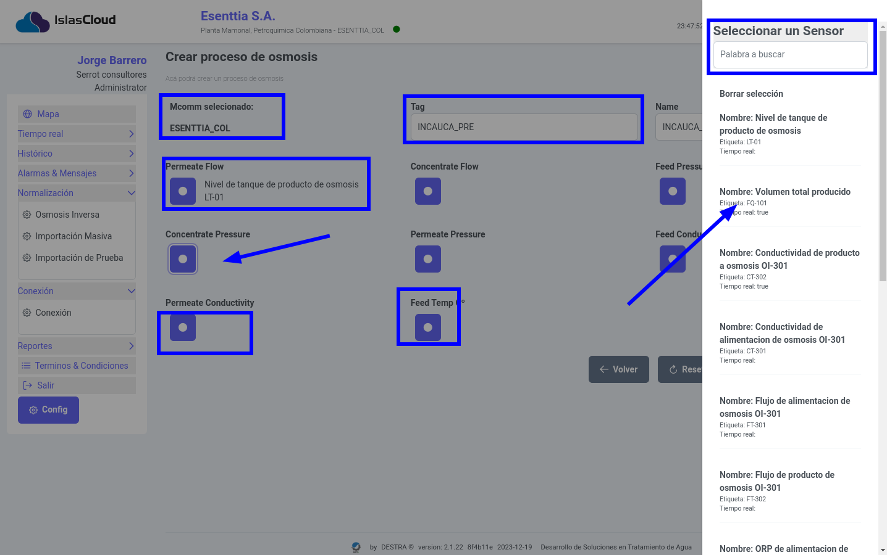
> Como se puede apreciar en la imágen el formulario tiene los siguientes campos de registros **Mcomm seleccionado**: **`nombre del sensor, tag, nombre`**, varios botones en donde se seleccionara los diferentes procesos que se van a registrar, al hacer clic se habilita un siderbar con la información del proceso a registrar. ejemplo **Permeate Flow.** 

### Filtrar Ósmosis

> Al hacer clic al botón esta accion muestra un formulario para buscar en la base de datos.  

### Formulario datos filtar Ósmosis
> Con este formulario modal, el usuario podra realizar la busqueda en la base de datos la información de los datos del osmosis, en la imagen se puede apreciar un campo tipo lista desplegable para seleccionar la etiqueta de ósmosis, dos campos de fecha inicial y final para filtrar por el rango de selección de fecha, y por último dos botones para realizar la accion de busqueda.

{/*  */}
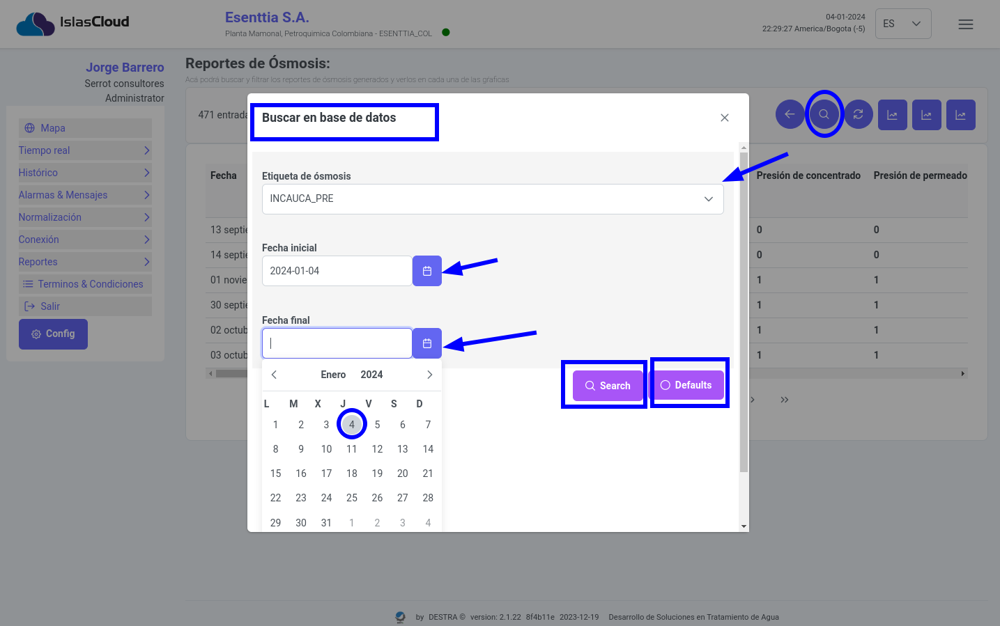
> Elementos del formulario, lista desplegable con los datos de la etiqueta de ósmosis, cammpos de **fecha inicial** y **final** para seleccionar los rango de fecha, dos botones 1) **S**earch** para realizar la busqueda por el flitro, 2) **Default** para realizar lña busqueda por defecto.

{/* Seleccionar el side bar */}
---

> En la imagen poder ver el side bar con los diferentes elementos que el usuario puede seleccionar, con un clic, la acción es cuando se preciona el botón de algun proceso, abre el sidebar, luego con un clic se muestra la información del sensor seleccionado en boton con el titulo y la descripción del mismo.
---

### Editar proceso de Ósmosis 
> El usuario podra editar un proceso de `ósmosis registrado  a traves del formulario como se aprecia en la imagen` 

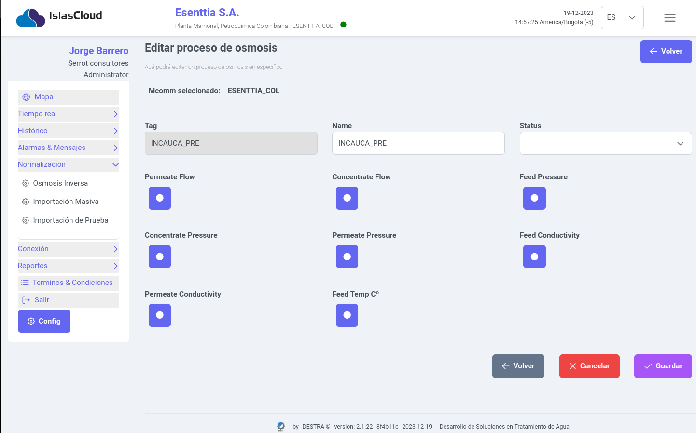
> Formulario para editar el proceso de ósmosis.
---

> Puede seleccionar la información de los sensores llamando al sidebar con accionar haciendo clic a un botón con el proceso que desea editar.

---
### Reiniciar Proceso de Ósmosis 

> Formulario para reiniciar el proceso de ósmosis.

---

## Importación Masiva
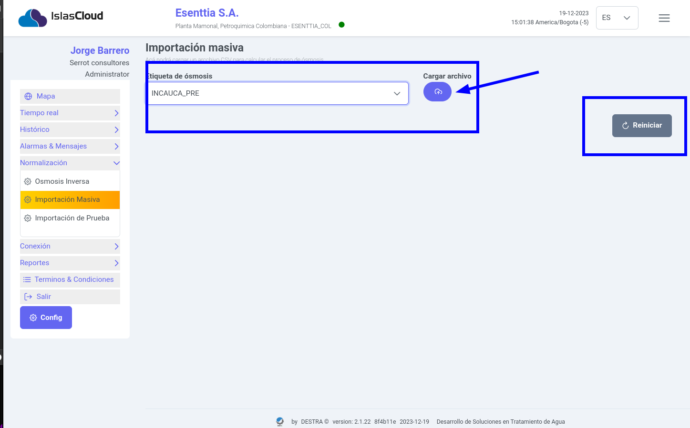
> Formulario que cumple la funcion se carcgar un archivo de formato CSV para realizar los cálculos del proceso de ósmosis.

---

## Inportación Test
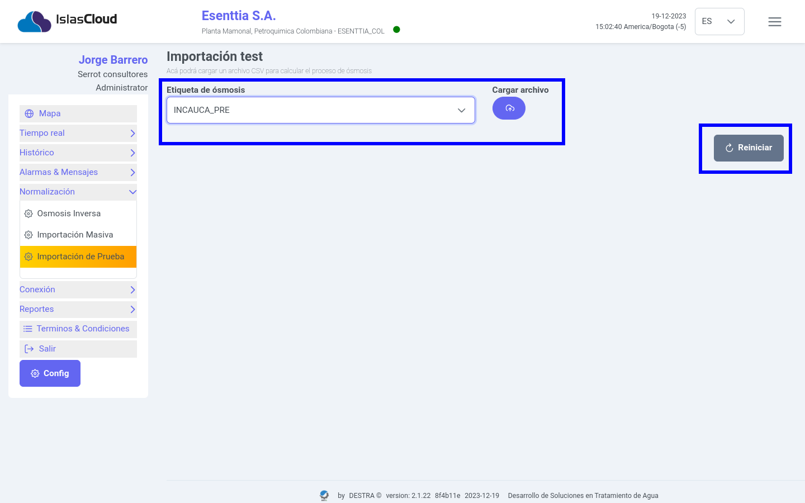
> Formulario que cumple la funcion se carcgar un archivo de formato CSV para realizar los cálculos del proceso de ósmosis.

---

# Módulo Conexion
## Conexion
> Módulo de la conexión de los sensores Mcomm

> Listado de los Mcomms, para ver cuáles  se encuentran encendidos y apagados.
---
### Elementos modulo de Conexión
> 

> En la imagen se puede observar los elementos principales del módulo de conexión, **1) Botón de busqueda (filtrar) y botón de actualizar**, **2) Nombre del Módulo**, **3)Cantidad de registros**, **4) tabla que contiene los siguientes campos: **Status: muestra si el sensor esta encendio o apagado**, Nombre: describe el nombre del sensor, Organización: Muestra el nombre de la organización, Nombre de proceso: describe el tipo de proceso, Sitio: dirección fisíca de la Organización** 
---

### Tópicos
> Información de Tópicos

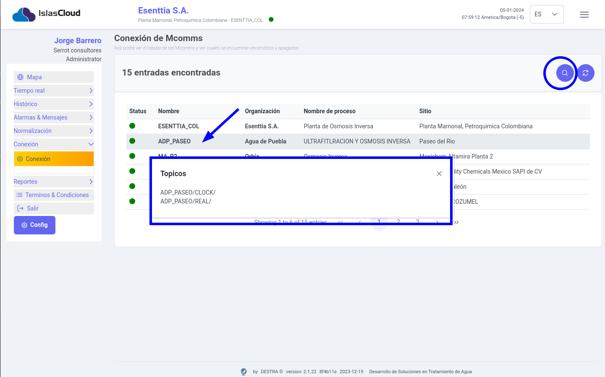
> `En la tabla al momento de seleciona con un clic un registro, se abre un cuadro de mensaje con los tópicos de los sensores Mcomm`. 
---

## Módulo Reportes

> Este módulo permite al usuario Generar el reporte diario de los procesos del Mcomm. a traves de un formulario se puede llenar dicho, tambien se puede editar, archivar y exportar en formato pdf. 

---

## Listado de reportes
> Este módulo muestra al usuario los registros de los reportes en una tabla, la cuál tiene los siguientes campos: **Nombre, Asunto, Tipos de reportes, Modalidad, Acciones** este campo de acciones tiene a su vez los siguientes elementos: **ver,editar, exportar PDF , archivar**.
---

> `Interfaz gráfica del módulo Lista de Reportes`
---

:::tip[Elementos principales de la interfaz gráfica]
**Módulo lista de reportes**, en la imagenes se puede apreciar los elementos resaltantes que se describen a continuación: 1) **Top bar de botones que realizan las siguientes acciones:** `Buscar, actualizar archivar y nuevo reporte`, 2) **Fecha de reinicio**, 3)**Fecha normalizada**,4)**datos**, 5) **Botones de configuración, normalización y Reporte**
:::

---

### Crear Reporte
> Este módulo presenta un formulario en donde el usuario podrá crear un nuevo reporte. **Botón Nueva Ósmosis**: habilita un formulario para registrar los datos de un nuevo proceso de ósmosis; 

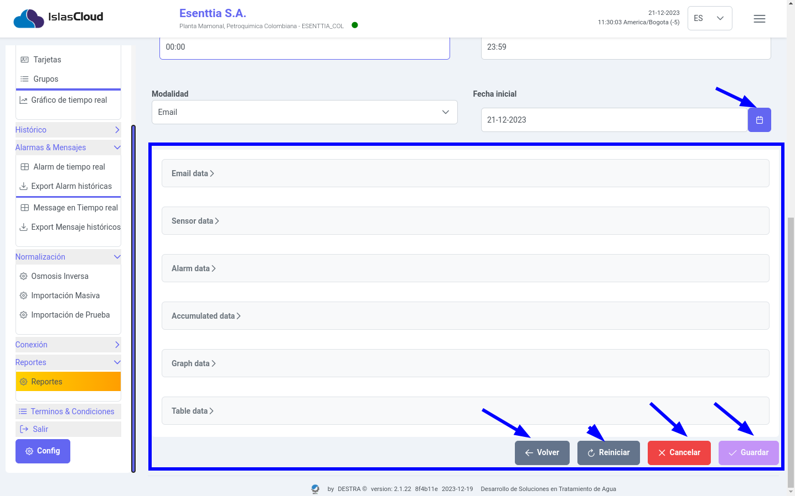
> **`Culminado el llenado del formulario el usuario podra realizar las acciones de guardar o enviar, cancelar el formulario, reiniciar los campos del formulario limpiando los datos y finalmente salir del módulo`**.

---

### Editar Reporte 
> Este módulo presenta un formulario en donde el usuario podrá editar los datos del reporte creado o registrado.

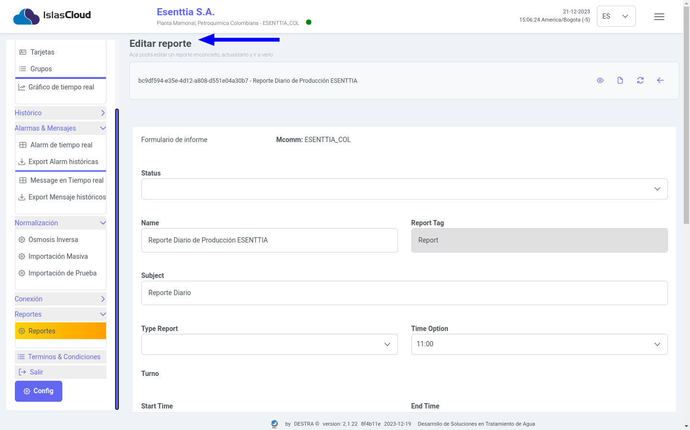

---

### Generar Un Reporte PDF 
> Este ícono permite al usuario exportar el registro del reporte en formato pdf. haciendo click en el mismo.

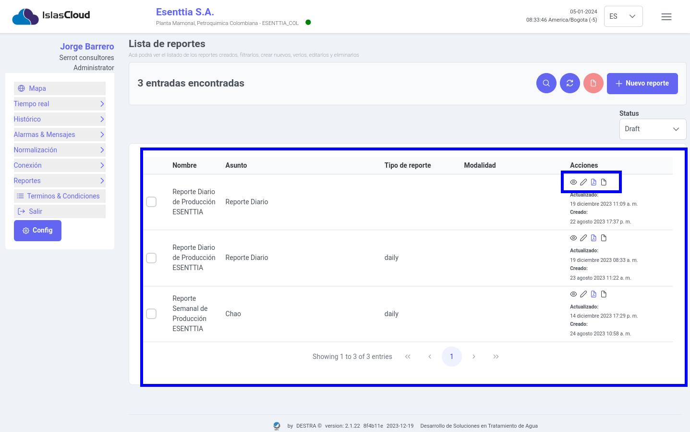

### Guardar Reporte Pdf.
> Al efectuar la exportación del informe a un archivo PDF, el sistema abrirá un cuadro de diálogo que permite al usuario guardar de manera persistente el archivo en formato PDF en su equipo. Este proceso facilita la conservación y acceso posterior al informe generado. 
---

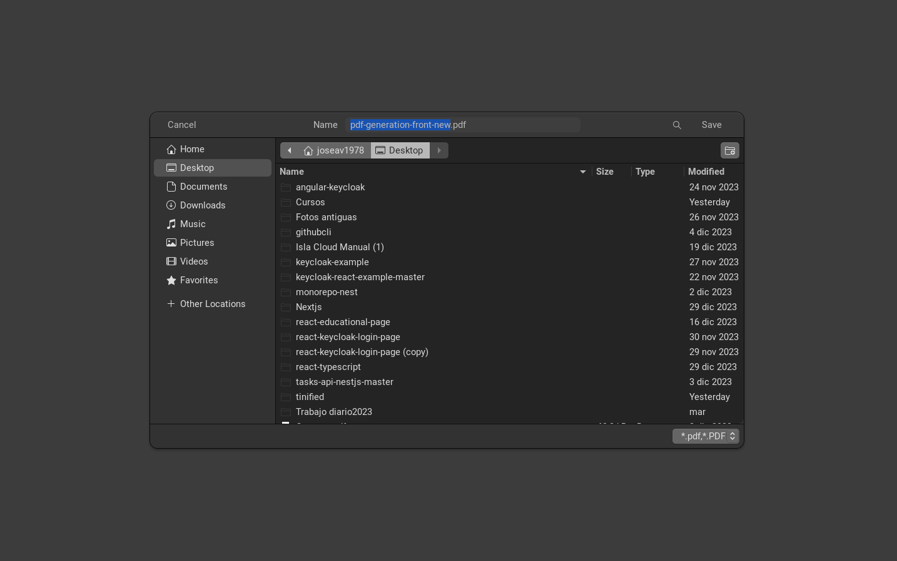

---

### Reporte Generado en PDF
> El usuario ya puede dispones del archivo genrado para su analisis posterior.

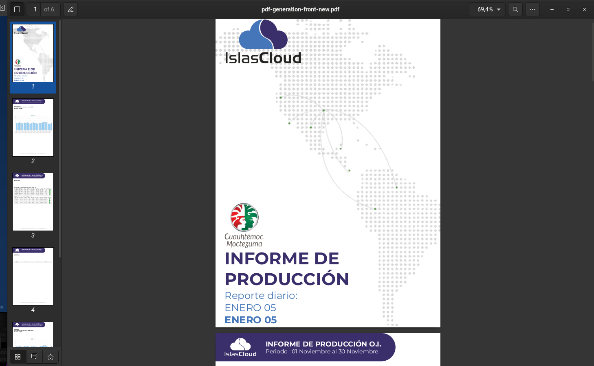

---
## Modulo Términos y condiciones

  
Mostrar

  
  
:::info Términos y Condiciones de Uso de la Plataforma IslasCloud

### Descripción del Servicio.
### Generalidades.
>La plataforma IslasCloud se diseña para contener los datos de sensores, operación, alarmas y eventos, en tiempo real e históricos, almacenamiento en la nube con acceso protegido por contraseña. Para cualquier otro uso del Servicio y el acceso al contenido, deberá tener su cuenta y facilitar la información de registro a de la Compañía que contrata el servicio. Es su responsabilidad mantener sus contraseñas resguardadas y no compartirlas, son de uso individual.

### Acceso al Contenido.
>Usted puede acceder al contenido en la nube la cantidad de veces que lo desee siempre que se haya suscrito al Servicio y esté cubierta la cuota. Tendrá que aceptar los términos y los acuerdos de licencia del usuario final y términos de servicio para que pueda interactuar con el Servicio. Su negativa a aceptar los términos de dichos acuerdos limitaría su capacidad para utilizar plenamente el Servicio. Además, el servicio sólo funciona con dispositivos compatibles.

### Restricciones.
> El uso del Servicio, por parte de usted, está sujeto a las siguientes restricciones:

### Normas y políticas de la Compañía.
>Al utilizar el Servicio, usted estará sujeto a cualquier otra directriz o norma aplicable a los servicios y características específicas que se publiquen en forma ocasional (las "Directrices"). Todas las Directrices se incorporan mediante referencia a estos Términos de Servicio. Estas Directrices se aplicarán en forma general de manera no discriminatoria a todos los usuarios finales del Servicio y podrían incluir, por ejemplo, actualizaciones, modificaciones y reinstalaciones del software requeridas o automáticas, y la obtención de parches disponibles para, entre otras razones, abordar cuestiones de seguridad, interoperabilidad y/o funcionamiento. Estas actualizaciones, modificaciones y operaciones similares pueden realizarse en forma periódica o cuando sea necesario, sin previo aviso. Además, usted entiende que determinados aspectos del Servicio son capaces de controlarse a sí mismos y pueden crear un sistema especial de identificación con fines relacionados con la seguridad y la detección de manipulaciones indebidas. El acceso de usted a determinadas aplicaciones está sujeto a restricciones por motivos de seguridad o según las políticas de protección de Contenido consistentemente aplicadas. Usted entiende y acepta que es probable que el Contenido que anteriormente estaba disponible para su uso, no se encuentre disponible a partir de ese momento.

### Requisito de edad.
>Usted debe tener al menos 18 años de edad para convenir y aceptar estos Términos de Servicio en nombre propio. Si es menor de 18 años no podrá hacer uso de la plataforma, debe registrarse para el Servicio en nombre de usted. De conformidad con la Ley de Protección de Menores en Internet (COPPA, por sus siglas en inglés), y según las modificaciones que se realicen en forma ocasional, si es menor de 13 años, se le solicita que no proporcione información alguna para el uso del servicio o cualquier otra actividad.

### Conducta prohibida.
>Usted no utilizará el Servicio para transmitir, mostrar, ejecutar o de algún modo poner a disposición mensajes, contenidos o materiales (i) que sean ilegales, obscenos, amenazantes, masivos no solicitados o "spam", difamatorios, invasores de la privacidad, o (ii) que violen o infrinjan derechos de autor, marcas registradas, patentes, secretos comerciales y otros derechos de propiedad intelectual, derechos de privacidad o publicidad, reglamentos o estatutos de comunicaciones, o cualesquiera otras leyes, incluyendo, sin limitación, las leyes sobre difamación, acoso, obscenidad y pornografía; (iii) que constituyan campañas políticas o solicitudes de venta o marketing o que contengan virus informáticos u otro código de computadora destinado a interferir con la funcionalidad de los sistemas de computadoras, o (iv) que de alguna manera perjudiquen a los menores. Usted conviene no interrumpir ni intentar interrumpir la operación o el Servicio de ninguna manera. Durante el uso se espera se comporten de una manera adecuada y respetuosa, teniendo en cuenta un alto estándar de educación. Cualquier violación a lo aquí dispuesto, estará sujeta a la revisión y las acciones pertinentes que la Compañía decida adoptar, a su sola consideración e inclusive proceder al derecho de Terminar el Servicio. Además, no podrá utilizar una dirección de correo electrónico falsa o de algún modo engañar a otros miembros en cuanto a su identidad o al origen de un mensaje o contenido.

### Restricción sobre el uso relacionado con el Servicio.
> El Servicio incluye componentes de seguridad por lo que se aplican normas y políticas especiales. Usted no deberá intentar (ni apoyar los intentos de otros) eludir, aplicar ingeniería inversa, descifrar, descompilar, desmontar o de algún modo modificar, alterar o interferir con ningún aspecto del Servicio. Usted no podrá distribuir, intercambiar, modificar, vender o revender, o transmitir a cualquier otra persona cualquier parte del Servicio, incluyendo, sin limitación, cualquier texto, imagen o audio, para cualquier propósito empresarial, comercial o público. Usted conviene en no copiar, vender, distribuir o de algún modo transferir Contenido, salvo del modo expresamente permitido en el presente.

### Cargos y facturación.
### Acuerdo de pago.
>Usted acepta pagar por todo el Contenido y servicio. El Usuario otorga su consentimiento para comience la prestación del Servicio pactado una vez reciba la confirmación del pago

### Precio total.
>El servicio ofertado incluye todos los impuestos, costos y gastos que deba pagar el consumidor para adquirirlo. Por lo cual el Usuario debe revisar el precio antes de proceder al pago.

### Terminación.
>Nos reservamos el derecho a dar por terminada su Cuenta y/o el acceso por parte de usted al Servicio si infringe cualquiera de los Términos de Servicio. Si se diera por terminado su membresía y suscripción(s) al Servicio, no serán reembolsables las cuotas ni los cargos.

### Impuestos.
>Las compras en el Servicio pueden incluir el impuesto sobre ventas o el impuesto al valor agregado (cuando proceda) y dicho impuesto se basará en la mejor información disponible acerca de su dirección. En tales casos, se aplicará el tipo impositivo que esté en vigor en el momento en que se realicen las compras en el Servicio. Si cambia el tipo impositivo aplicable a las ventas antes de finalizar las compras correspondientes, se aplicará el nuevo tipo impositivo que esté en vigor en el momento de concretar la compra en el Servicio. Podrían aplicarse otras limitaciones y renuncias a la responsabilidad sobre productos y servicios. Usted será el único responsable de pagar la totalidad de dichos impuestos.

### Derecho al cambio de precios
>Todos los precios relacionados con el Servicio están sujetos a cambios en cualquier momento, sin previo aviso y sin responsabilidad alguna hacia el Usuario. No ofrecemos una protección de precios o reembolsos en caso de una caída de precios o una oferta promocional. Se presentará el precio total al momento de pagar.

### Pagos.
>Se realizará el pago del servicio por transferencia bancaria o cheque en moneda nacional una vez generada la factura correspondiente a partir de la confirmación de la transferencia o depósito, la entidad bancaria contará con los tiempos dispuestos según sus políticas internas. El Usuario deberá sujetarse a los términos de duración del proceso de aplicación estipulado por su banco.

### Reembolsos.
>Salvo disposición legal contraria, los pagos realizados no son reembolsables en ninguna circunstancia. El Usuario deberá sujetarse a los términos de duración del proceso de aplicación estipulados bien sea por su banco.

:::

---
# Configuraciones

 :::warning[INFO]
   
   Únicamente los usuarios con roles de Administrador (**Admin**) y Tecnología de la Información (**IT**) tienen privilegios de acceso a los módulos de **Configuración** y **Usuario**. Esta distinción se aplica exclusivamente en el contexto de la interfaz del usuario.
 :::
## Configuraciones 
> Para acceder a este módulo el **usuario debe seleccionar** con un clic el boton `config`, Este módulo muestra al usuario **las configuraciones del sistema como la información general, los datos del Mcomm actual y sus valores, los datos de la cuenta de usuario del sistema**.
---

### Módulo de Información General del Sistema 

> **Este módulo muestra al usuario la información general del sistema**
---

> `Información General del sistema`,  **Ventana, Versión, Hash, Hotname, hora local, Zona horaria.**
---

### Módulo de comunicación

> Este módulo muestra al usuario la información del sensor Mcomm, una representación de los datos en una tabla auxiliar, con información del nombre **Etiqueta o nombre corto**, **Nombre largo del sensor** y la **Unidad de medida.**
---

> `Interfaz gráfica del módulo de comunicación`, cuenta con los botones **Abrir enlace** y **Mapa de google**, el botón **Abrir enlace** abre una ventana con la información del sensor y el botón **Mapa de google** abre una ventana con la ubicación fisíca del mcomm.

---

### Enlace para ingresar al administrador del mcomm

>Para acceder al URL el usuario debe seleccianar con un clic el botón  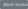  [https://us2.m2web.talk2m.com/islas_colombia/Esenttia/#](https://us2.m2web.talk2m.com/islas_colombia/Esenttia/#), esta area solo ingresa el administrador del sistema.

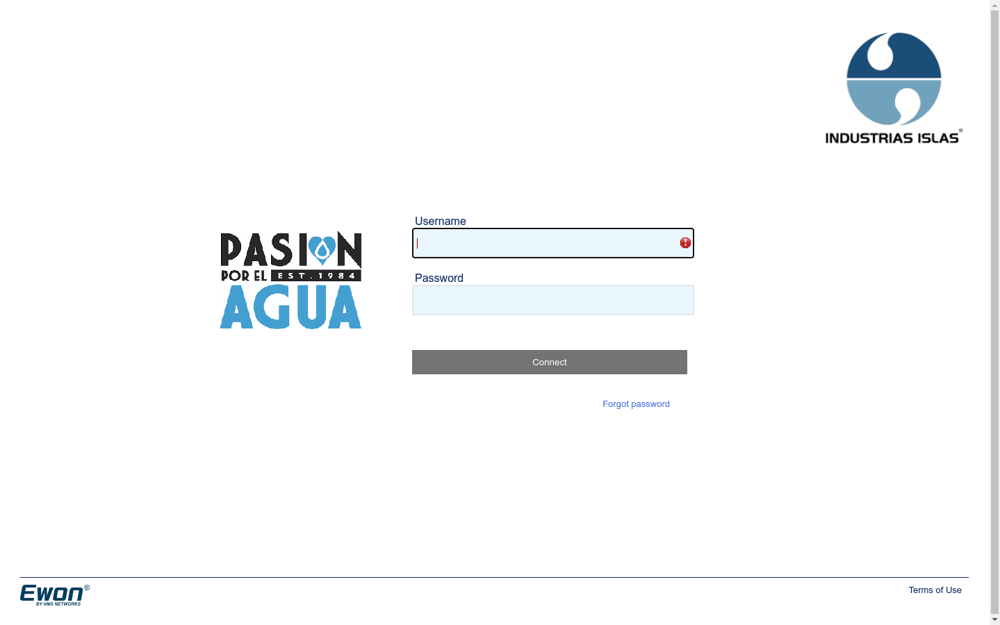

---

### Ubicación fisíca de la planta en donde esta instalado el mcomm
> Para acceder al **URL** el usuario debe seleccianara con un clic el botón  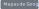,  `despúes Atraves de la ubicagión GPS, se muestra el mapa con las coordenadas y ubicación fisíca de la planta donde se encuentra instalado el flexy mcomm`. **en este ejemplo de la imagen podemos ver la ubicación de la Planta Mamonal, Petroquimica Colombiana - ESENTTIA_CO, ubicada en el país de Colombia**.

----

---
## Módulo Listado Mcomm

### Listado de Mcomm
> Este módulo permite  al usuario gestionar el listado de los Mcomm, la información se muestra en la tabla que contiene la siguiente descripción **Name nombre del mcomm, tipo, fecha de creación, status, aciones**

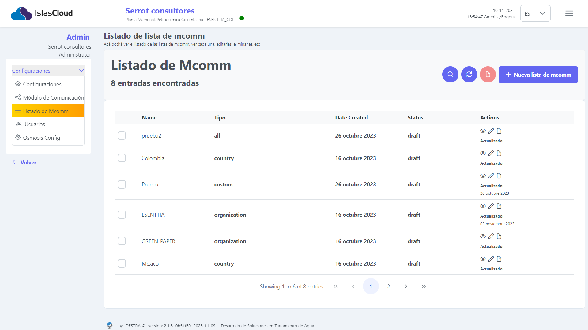

---

### Crear Listado de Mcomm
> Este módulo permite  al usuario gestionar el listado de los Mcomm, la información se muestra en la tabla que contiene la siguiente descripción **Name nombre del mcomm, tipo, fecha de creación, status, aciones**

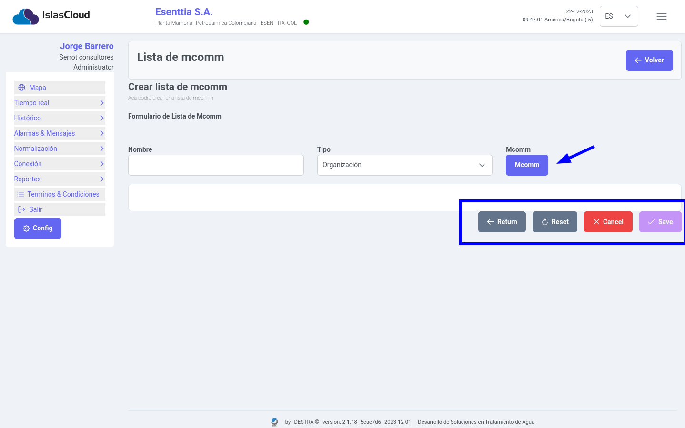

---

### Seleccionar Mcomm

> Este módulo permite  al usuario gestionar el listado de los Mcomm, la información se muestra en la tabla que contiene la siguiente descripción **Name nombre del mcomm, tipo, fecha de creación, status, aciones**

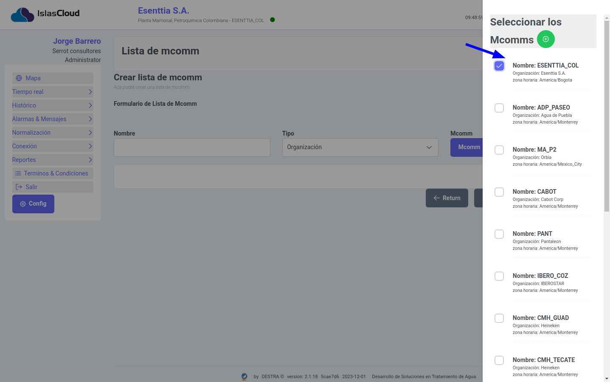

---
### Editar Listado de Mcomm 
> Este módulo permite  al usuario gestionar la edición  listado de los Mcomm.

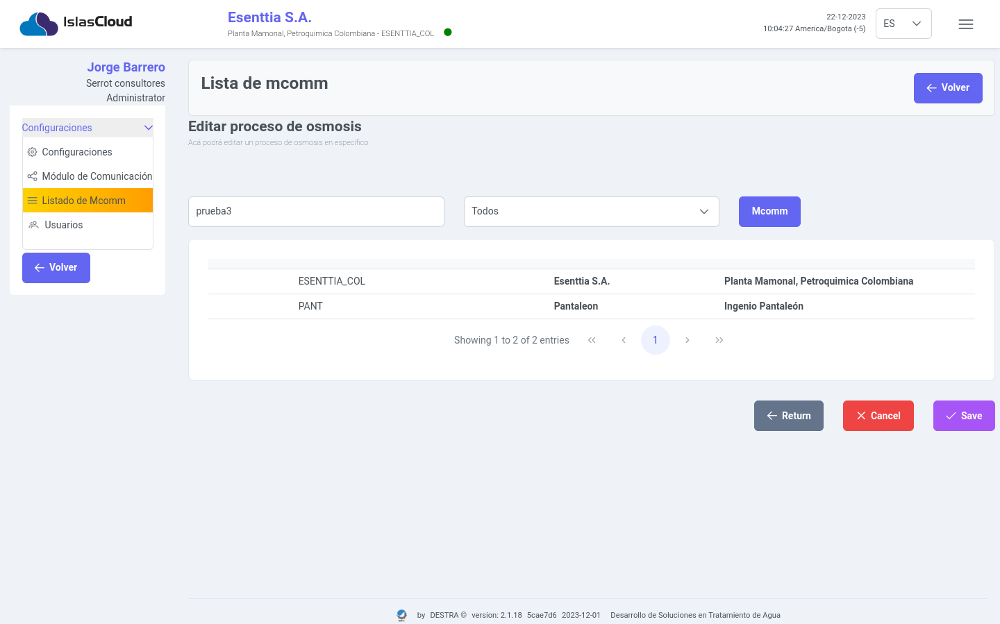

---
## Módulo Usuarios 
### Listado de Usuarios
> Este módulo permite  al usuario gestionar el listado de los usuarios del sistema, la información se muestra en la tabla que contiene la siguiente descripción **Name nombre de de pila, lastName:Apellidos  correo electronico: correo del usuario, organización: Nombre de la empresa, Estado: estado activo o inactivo, aciones: botones de las acciones para hacer el CRUD ne el modulo.**

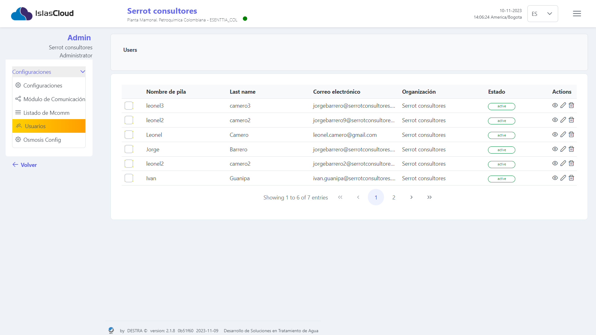
>Interfaz del modulo de usuario, muestra un atabla con la información de los registro de los usuarios del Sistema
---

### Agregar un nuevo Usuario 
> Este módulo permite  registra un nuevo usuario para ingresar al sistema a trave del formulario que se aprecia en la imagen.

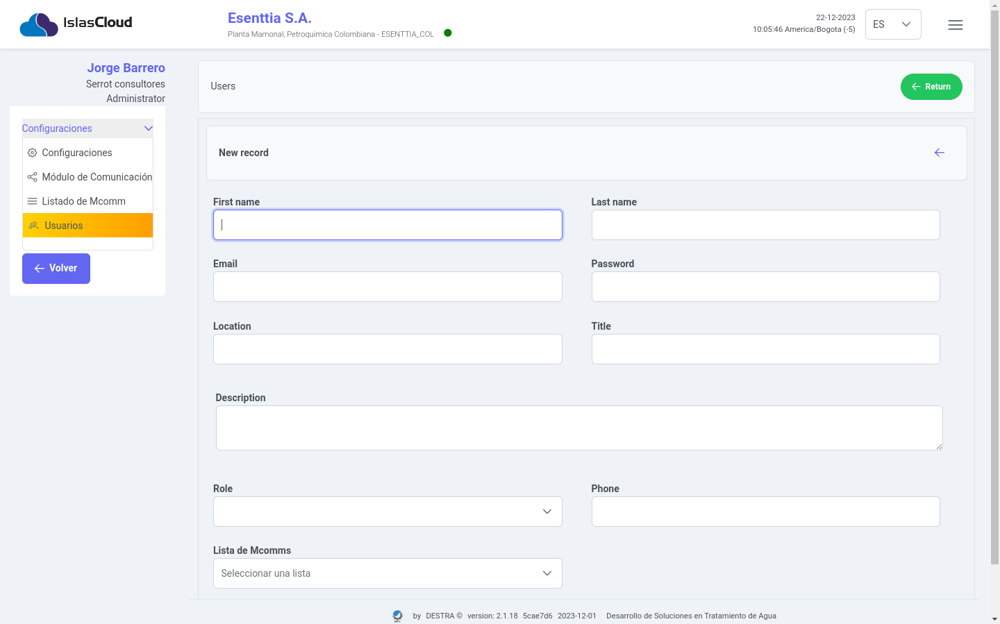

---
### Ver usuarios 
> Este módulo permite  al usuario gestionar el listado de los Mcomm, la información se muestra en la tabla que contiene la siguiente descripción **Name nombre del mcomm, tipo, fecha de creación, status, aciones**

---
### Editar Usuario 
> Este módulo permite  al usuario gestionar la edicion de la información de un usuario

----

### Eliminar Usuario  

> Con este ícono el usuario podra borrar o deshabilitar el registro del usuario que seleccione.
{/* <i className="pi pi-spin pi-spinner" style={{'fontSize': '2em'}}></i> */}