import Highlight from '@site/src/components/Highlight/Highlight';
import 'primeicons/primeicons.css';

# It 

<Highlight color="#222">Módulo del Usuario It </Highlight>

## Usuario Administrador
> Bienvenidos a la página del usuario It.

### Dashboard Principal - Mapa 

> **Interfaz del Dasboard Principal**, esta compuesta con los siguientes elementos, menú de navegación hacia los diferentes módulos, dos listas desplegables, la primera **Grupos de módulos** que permite seleccionar el grupo de módulos de comunicaciones, el segundo **Módulos de cominicación** que permite seleccionar el **módulo de comunicaciones - Sensores**.

> Lista desplegable para seleccionar El grupo de módulos  
---

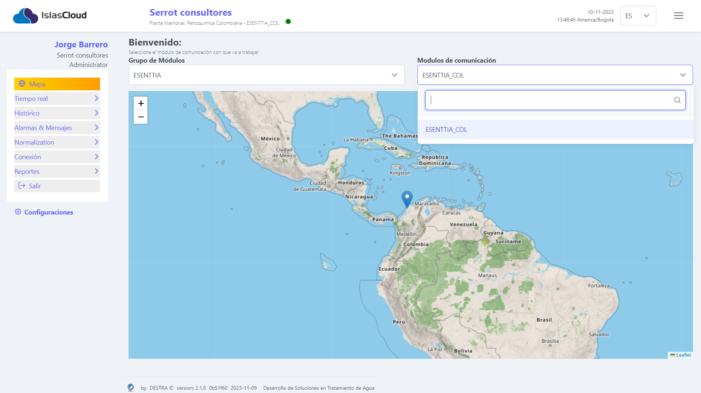
> Lista desplegable para seleccionar el módulo de comunicación   

---

:::info
Al momento de seleccionar  con un clic el ícono de **gps**, redireciona a la vista **Tiempo Real Tablas**, interfaz que muestra  el listado de los sensores de manera detallada.
:::  

---
### Cambio de idioma 
> Para cambiar el idioma del sistema, seleccione el lista desplegable (dropdown) de **idioma** y seleccione el idioma que desea utilizar.

:::info
Al momento de seleccionar  con un clic la lista desplegable se  cambia el idioma de la interfaz del istema. **Solo se puede cambiar al idioma inglés o español**.
::: 

---
### Menú de navegación
> Menú de navegación del sistema.

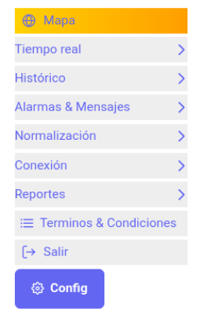
> **El menú principal de navegación del sistema**, cuenta con los siguientes elementos:  

1. **Mapa**
2. **Tiempo Real:**
   - Tablas
   - Tarjetas
   - Grupos
   - Gráfico de Tiempo Real
3. **Histórico:**
   - Gráficos Históricos
   - Exportar Sensor Histórico
4. **Alarmas & Mensajes:**
   - Alarmas de Tiempo Real
   - Exportar Alarmas Históricas
   - Mensajes en Tiempo Real
   - Exportar Mensajes Históricos
5. **Normalización:**
   - Osmosis Inversa
   - Importación Masiva
6. **Conexión**
7. **Reporte**
8. **Términos y Condiciones**
9. **Salir**
10. **Configuraciones:**
    - Configuraciones Generales
    - Módulo de Comunicaciones
    - Listado de Mcomm
    - Usuarios

> Definiendo la esctructura de navegación del sistema

----

## Menú Tiempo Real

:::info
   El Menú de tiempo real permite al usuario visualizar el estado de los sensores en tiempo real. el menú esta compuesto de los módulo **Tablas  , Tarjetas , Grupos , Gráfico de tiempo real **
:::
---
## Módulo Tablas  

> Este módulo presenta una tabla de los sensores en tiempo real, los campos representados  son los siguientes **`Sensor, #, Name, Type, Value, Unit, Min value, Max Value`**, que describen los datos que estan transmitiendo en  los sensores Mcomm.

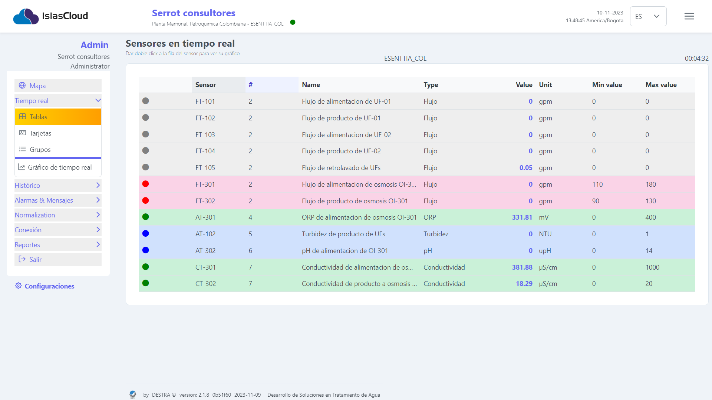

> Listado de los sensores que estan transmitiendo información en tiempo real. si el usuario selecciona con un clic un sensor de la lista, esta acción hace que se redirecione a la vista del módulo del grafico de tiempo real, mostrado el comportamiento del sensor en una gráfica.

---

## Módulo Tarjeta  

> Este módulo presenta un Card de los sensores en tiempo real, la información que describe es la siguiente **`Sensor, Nombre,  Value, Unit`.**

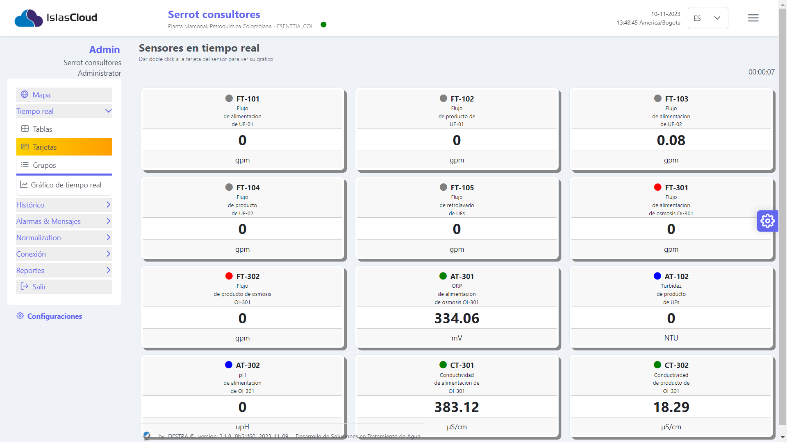
> Esta vista **agrupa la informacion de los sensores, a tráves componentes de tipo card, mostrando los datos de los sensores con información maś resumida**.    

---

## Módulo Grupos  

> Este módulo representa la agrupación de los sensores por tipos de **grupos** como se describe en la imagen **`Totalizadores de Producción,Transmisores de flujos,  Transmisores de nivel, Transmisores de ORP, Transmisores de Turbidez, Transmisores de pH, Transmisores de Conductividad.`**

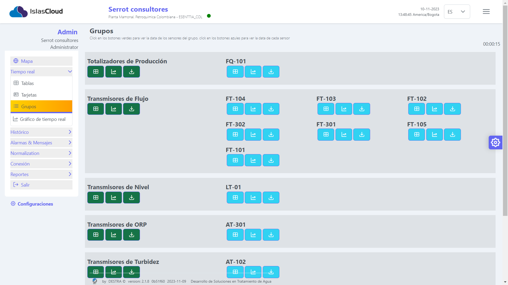
> Lista desplegable para seleccionar el módulo de comunicación   

---
## Módulo Grafico Tiempo Real  

> En este módulo el usuario  podrá ver los datos graficados del sensor, ir al gráfico histórico, descargar una imágen o exportar la data.

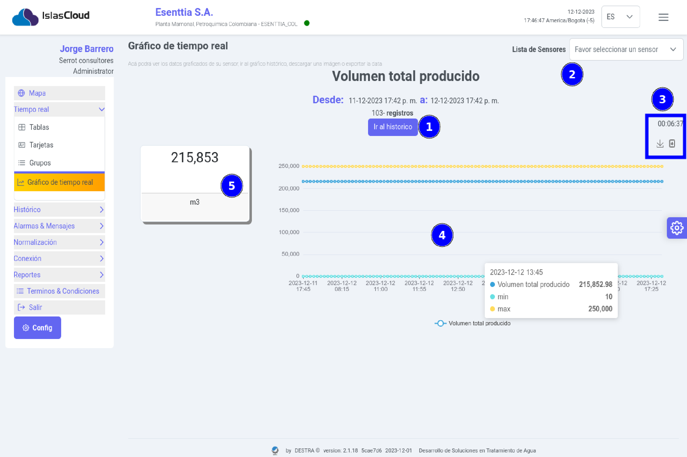

:::info[Gráfico de tiempo real]
En este módulo se muestra la gráfica en tiempo real del sensor, y los elementos destacables de la interfaz se mencionan a continuación, 1) **Botón ir a histórico**, que redirecciona a la vista Histórico,  2) **lista de sensores**, el usurio podrá seleccionar el sensor que quiera analizar, 3) **El tiempo real** de la lectura del sensor, con las opciones de exportar la data y descargar la imagen del gráfico, 4) **representación visual del grafico con sus metrícas**, 5) **Card con la información del sensor su unidad de medida y el valor producido**.
:::

---
## Módulo Histórico
> En este módulo el usuario podrá observar el comportamiento del sensor, y obtener los datos graficados en tiempo real o historicamente a tráves de un rango de fecha seleccionado, posteriormente tendrá la opción de exportar la data en difentes tipos de formatos **`("Excel", "CSV","TXT","JSON")`** haciendo clic en el ícono  y por útimo podrá descargar la imagen del gráfico en tiempo real o el histórico  haciendo clic al ícono  

> Interfaz del módulo Gráfico histórico
---
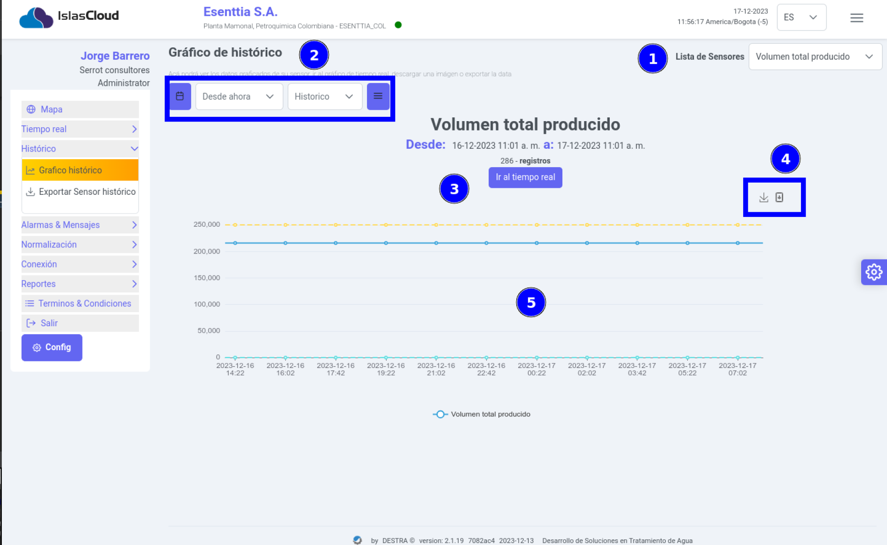
> Elementos del módulo Gráfico histórico **`1) Lista de los sensores, 2) selección de la fecha en rango desde ahora hasta histórico, 3) Bontón par ir al módulo tiempo real, 4) Botones para descargar imagen y exportar los datos, 5) Información gráfica del sensor`** 
---

>Interfaz del módulo tiempo real.
---

## Módulo Alarmas & Mensajes

### Alarmas tiempo real
> El módulo de **Alarmas**  tiene como función principal la visualización en tiempo real de las alarmas provenientes de diversos sensores, llevando un registro histórico de las mismas.

> **Esa tabla permitiría tener un registro histórico de todas las alarmas ocurridas, conocer cuáles están aún activas y tener la información necesaria para que un operador pueda evaluar y atender la situación que la provocó.**

---

:::note Nota

>La información Cada alarma queda almacenada en una tabla con los siguientes campos:

- Etiqueta **Nombre del sensor**
- Estatus **(activa/inactiva)**
- Tiempo **Fecha y hora cuando se activó la alarma**
- Tipo **Identificador del tipo de alarma**
- Mensaje **Descripción textual de la alarma**

:::

---

### Exportar Alarmas

> El módulo de exportar alarmas  tiene como función principal de configurar y exportar la data de las alarmas.

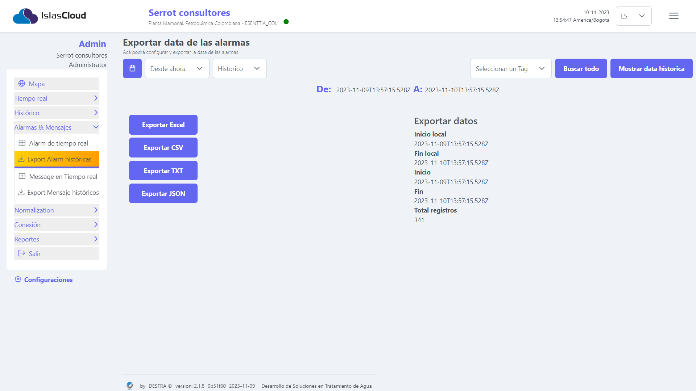
> Interfaz del módulo de exportar alrmas
---

> Elementos principales del módulo exportar data de las alarmas.

:::info[]
1. Botón de selección de **fecha**, lista desplegable **desde ahora, Histórico**.
2. Lista desplegable **Seleccionar un tag**, y botones **Buscar todo, mostrar data histórica**.
3. Botones **Exportar Excel**,**Exportar CSV**,**Exportar TXT**,**Exportar JSON**
4. **Descripción de exportar datos**

:::
----

### Mensajes tiempo real

> El módulo de **Mensajes**  tiene como función principal la visualización en tiempo real de los mensajes provenientes de los sensores, llevando un registro histórico de las mismas.

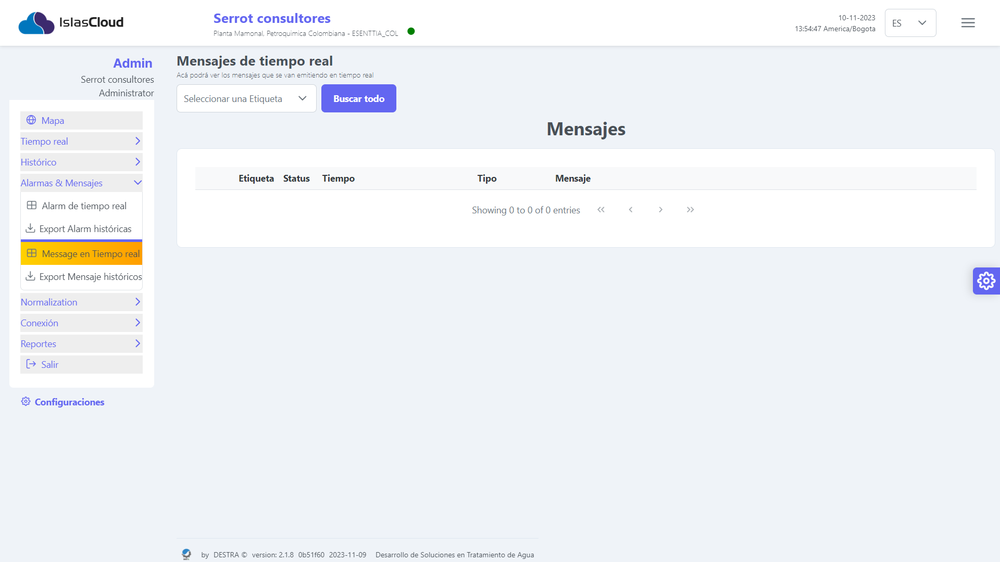

:::note Nota

>La información Cada alarma queda almacenada en una tabla con los siguientes campos:

- Etiqueta **Nombre del sensor**
- Estatus **(activa/inactiva)**
- Tiempo **Fecha y hora cuando se activó la alarma**
- Tipo **Identificador del tipo de alarma**
- Mensaje **Descripción textual de la alarma**

:::

---

> Elementos principales del módulo exportar data de las alarmas.

:::info[]
1. Botón de selección de **fecha**, lista desplegable **desde ahora, Histórico**.
2. Lista desplegable **Seleccionar un tag**, y botones **Buscar todo, mostrar data histórica**.
3. Botones **Exportar Excel**,**Exportar CSV**,**Exportar TXT**,**Exportar JSON**
4. **Descripción de exportar datos**

:::

## Módulo Normalización
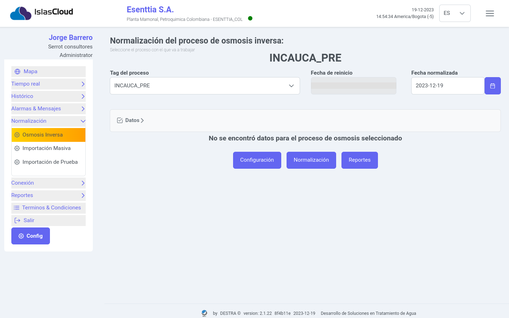
> Este módulo comprenderá los siguientes elementos: Osmosis Inversa, Configuración Masiva e Importación de Pruebas.

---

:::tip
**Módulo de Osmosis Inversa**, en la imagenes se puede apreciar los elementos resaltantes que se describen a continuación: 1) **Tag del proceso**, 2) **Fecha de reinicio**, 3)**Fecha normalizada**,4)**datos**, 5) **Botones de configuración, normalización y Reporte**
:::

---
### Configuración de proceso de osmosis inversa
> Este módulo permite configurar los parámetros de la osmosis inversa.

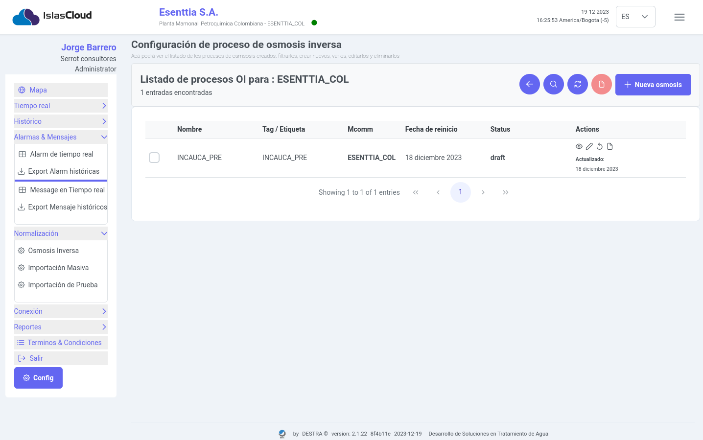
> List

### Creación de proceso e osmosis
> Este módulo muestra un formulario para el registro de un nuevo proceso de osmosis inversa.
---
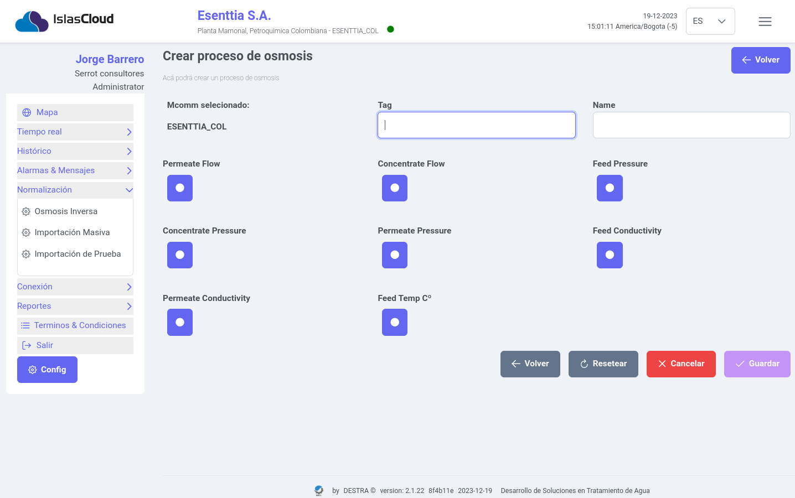
> List

---
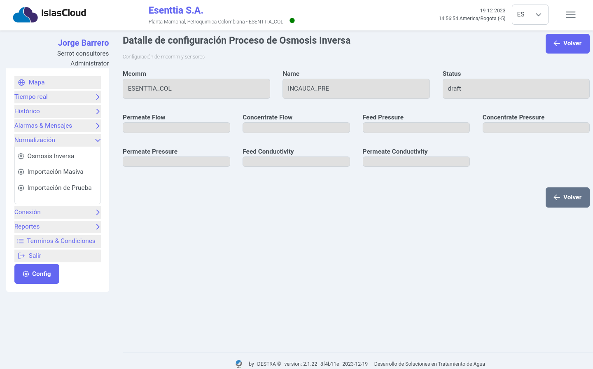
> List
---

> List
---
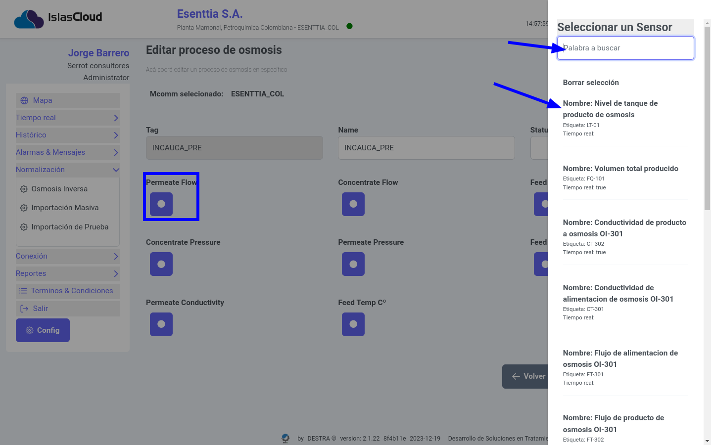
> List

---
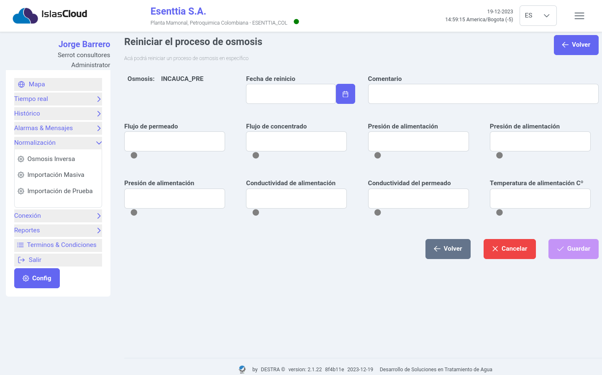
> List

---

> List

---

> List

## Módulo Conexion
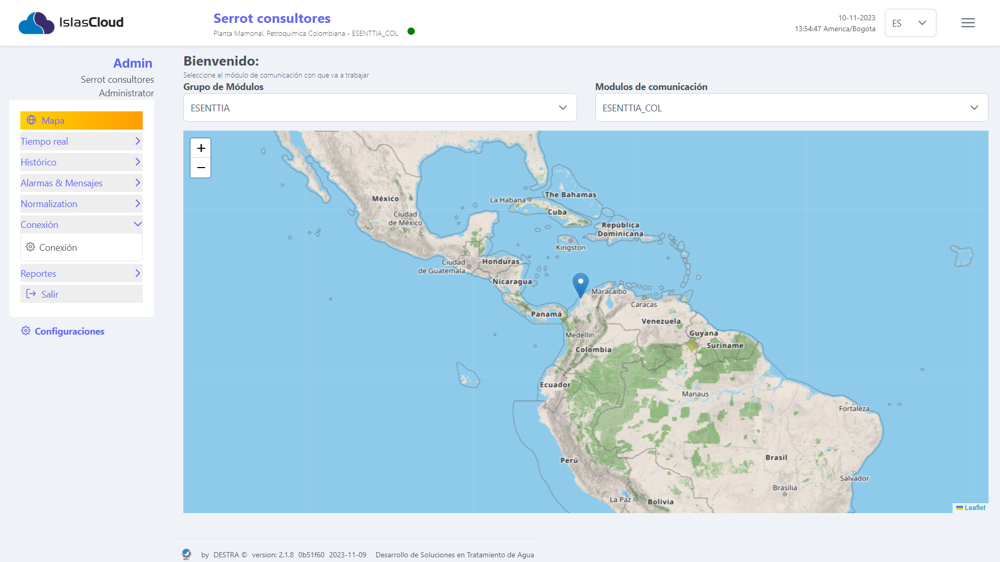
> List
---
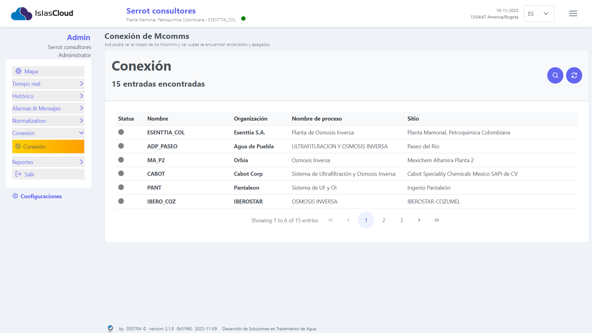
> List
---

## Módulo Reportes
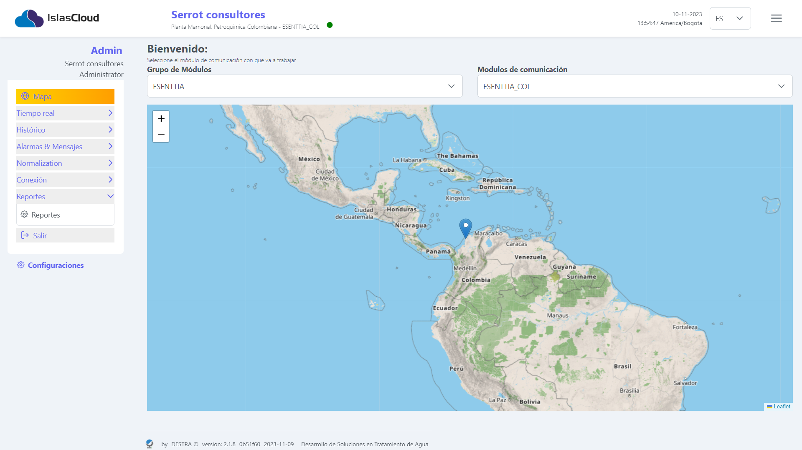
> List
---
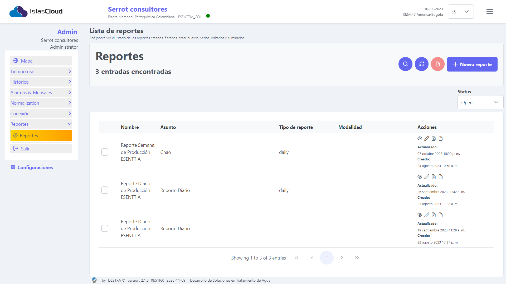
> List
---

# Modulo Términos y condiciones

:::info Términos y Condiciones de Uso de la Plataforma IslasCloud

### Descripción del Servicio.
### Generalidades.
>La plataforma IslasCloud se diseña para contener los datos de sensores, operación, alarmas y eventos, en tiempo real e históricos, almacenamiento en la nube con acceso protegido por contraseña. Para cualquier otro uso del Servicio y el acceso al contenido, deberá tener su cuenta y facilitar la información de registro a de la Compañía que contrata el servicio. Es su responsabilidad mantener sus contraseñas resguardadas y no compartirlas, son de uso individual.

### Acceso al Contenido.
>Usted puede acceder al contenido en la nube la cantidad de veces que lo desee siempre que se haya suscrito al Servicio y esté cubierta la cuota. Tendrá que aceptar los términos y los acuerdos de licencia del usuario final y términos de servicio para que pueda interactuar con el Servicio. Su negativa a aceptar los términos de dichos acuerdos limitaría su capacidad para utilizar plenamente el Servicio. Además, el servicio sólo funciona con dispositivos compatibles.

### Restricciones.
> El uso del Servicio, por parte de usted, está sujeto a las siguientes restricciones:

### Normas y políticas de la Compañía.
>Al utilizar el Servicio, usted estará sujeto a cualquier otra directriz o norma aplicable a los servicios y características específicas que se publiquen en forma ocasional (las "Directrices"). Todas las Directrices se incorporan mediante referencia a estos Términos de Servicio. Estas Directrices se aplicarán en forma general de manera no discriminatoria a todos los usuarios finales del Servicio y podrían incluir, por ejemplo, actualizaciones, modificaciones y reinstalaciones del software requeridas o automáticas, y la obtención de parches disponibles para, entre otras razones, abordar cuestiones de seguridad, interoperabilidad y/o funcionamiento. Estas actualizaciones, modificaciones y operaciones similares pueden realizarse en forma periódica o cuando sea necesario, sin previo aviso. Además, usted entiende que determinados aspectos del Servicio son capaces de controlarse a sí mismos y pueden crear un sistema especial de identificación con fines relacionados con la seguridad y la detección de manipulaciones indebidas. El acceso de usted a determinadas aplicaciones está sujeto a restricciones por motivos de seguridad o según las políticas de protección de Contenido consistentemente aplicadas. Usted entiende y acepta que es probable que el Contenido que anteriormente estaba disponible para su uso, no se encuentre disponible a partir de ese momento.

### Requisito de edad.
>Usted debe tener al menos 18 años de edad para convenir y aceptar estos Términos de Servicio en nombre propio. Si es menor de 18 años no podrá hacer uso de la plataforma, debe registrarse para el Servicio en nombre de usted. De conformidad con la Ley de Protección de Menores en Internet (COPPA, por sus siglas en inglés), y según las modificaciones que se realicen en forma ocasional, si es menor de 13 años, se le solicita que no proporcione información alguna para el uso del servicio o cualquier otra actividad.

### Conducta prohibida.
>Usted no utilizará el Servicio para transmitir, mostrar, ejecutar o de algún modo poner a disposición mensajes, contenidos o materiales (i) que sean ilegales, obscenos, amenazantes, masivos no solicitados o "spam", difamatorios, invasores de la privacidad, o (ii) que violen o infrinjan derechos de autor, marcas registradas, patentes, secretos comerciales y otros derechos de propiedad intelectual, derechos de privacidad o publicidad, reglamentos o estatutos de comunicaciones, o cualesquiera otras leyes, incluyendo, sin limitación, las leyes sobre difamación, acoso, obscenidad y pornografía; (iii) que constituyan campañas políticas o solicitudes de venta o marketing o que contengan virus informáticos u otro código de computadora destinado a interferir con la funcionalidad de los sistemas de computadoras, o (iv) que de alguna manera perjudiquen a los menores. Usted conviene no interrumpir ni intentar interrumpir la operación o el Servicio de ninguna manera. Durante el uso se espera se comporten de una manera adecuada y respetuosa, teniendo en cuenta un alto estándar de educación. Cualquier violación a lo aquí dispuesto, estará sujeta a la revisión y las acciones pertinentes que la Compañía decida adoptar, a su sola consideración e inclusive proceder al derecho de Terminar el Servicio. Además, no podrá utilizar una dirección de correo electrónico falsa o de algún modo engañar a otros miembros en cuanto a su identidad o al origen de un mensaje o contenido.

### Restricción sobre el uso relacionado con el Servicio.
> El Servicio incluye componentes de seguridad por lo que se aplican normas y políticas especiales. Usted no deberá intentar (ni apoyar los intentos de otros) eludir, aplicar ingeniería inversa, descifrar, descompilar, desmontar o de algún modo modificar, alterar o interferir con ningún aspecto del Servicio. Usted no podrá distribuir, intercambiar, modificar, vender o revender, o transmitir a cualquier otra persona cualquier parte del Servicio, incluyendo, sin limitación, cualquier texto, imagen o audio, para cualquier propósito empresarial, comercial o público. Usted conviene en no copiar, vender, distribuir o de algún modo transferir Contenido, salvo del modo expresamente permitido en el presente.

## Cargos y facturación.
### Acuerdo de pago.
>Usted acepta pagar por todo el Contenido y servicio. El Usuario otorga su consentimiento para comience la prestación del Servicio pactado una vez reciba la confirmación del pago

### Precio total.
>El servicio ofertado incluye todos los impuestos, costos y gastos que deba pagar el consumidor para adquirirlo. Por lo cual el Usuario debe revisar el precio antes de proceder al pago.

### Terminación.
>Nos reservamos el derecho a dar por terminada su Cuenta y/o el acceso por parte de usted al Servicio si infringe cualquiera de los Términos de Servicio. Si se diera por terminado su membresía y suscripción(s) al Servicio, no serán reembolsables las cuotas ni los cargos.

### Impuestos.
>Las compras en el Servicio pueden incluir el impuesto sobre ventas o el impuesto al valor agregado (cuando proceda) y dicho impuesto se basará en la mejor información disponible acerca de su dirección. En tales casos, se aplicará el tipo impositivo que esté en vigor en el momento en que se realicen las compras en el Servicio. Si cambia el tipo impositivo aplicable a las ventas antes de finalizar las compras correspondientes, se aplicará el nuevo tipo impositivo que esté en vigor en el momento de concretar la compra en el Servicio. Podrían aplicarse otras limitaciones y renuncias a la responsabilidad sobre productos y servicios. Usted será el único responsable de pagar la totalidad de dichos impuestos.

### Derecho al cambio de precios
>Todos los precios relacionados con el Servicio están sujetos a cambios en cualquier momento, sin previo aviso y sin responsabilidad alguna hacia el Usuario. No ofrecemos una protección de precios o reembolsos en caso de una caída de precios o una oferta promocional. Se presentará el precio total al momento de pagar.

### Pagos.
>Se realizará el pago del servicio por transferencia bancaria o cheque en moneda nacional una vez generada la factura correspondiente a partir de la confirmación de la transferencia o depósito, la entidad bancaria contará con los tiempos dispuestos según sus políticas internas. El Usuario deberá sujetarse a los términos de duración del proceso de aplicación estipulado por su banco.

### Reembolsos.
>Salvo disposición legal contraria, los pagos realizados no son reembolsables en ninguna circunstancia. El Usuario deberá sujetarse a los términos de duración del proceso de aplicación estipulados bien sea por su banco.

:::

---